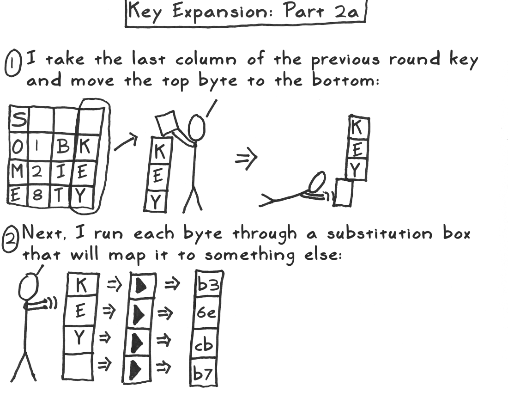
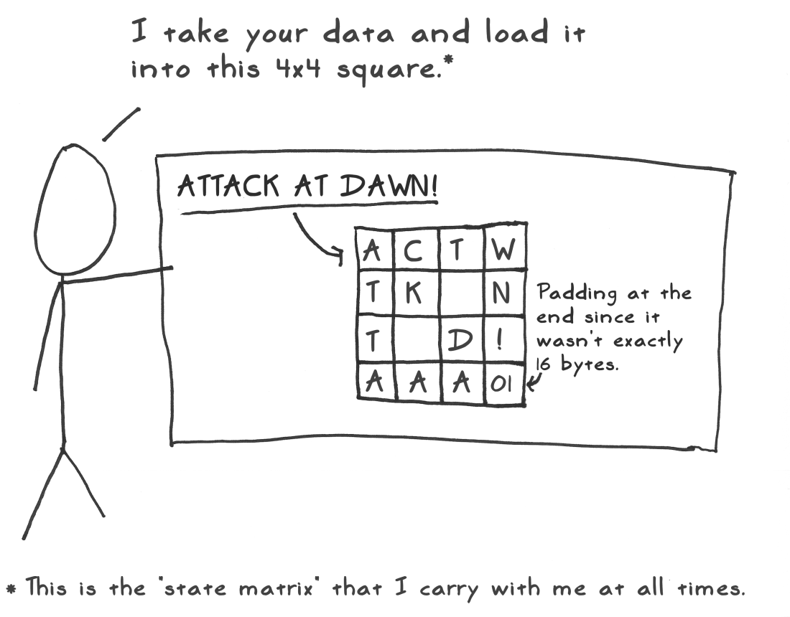
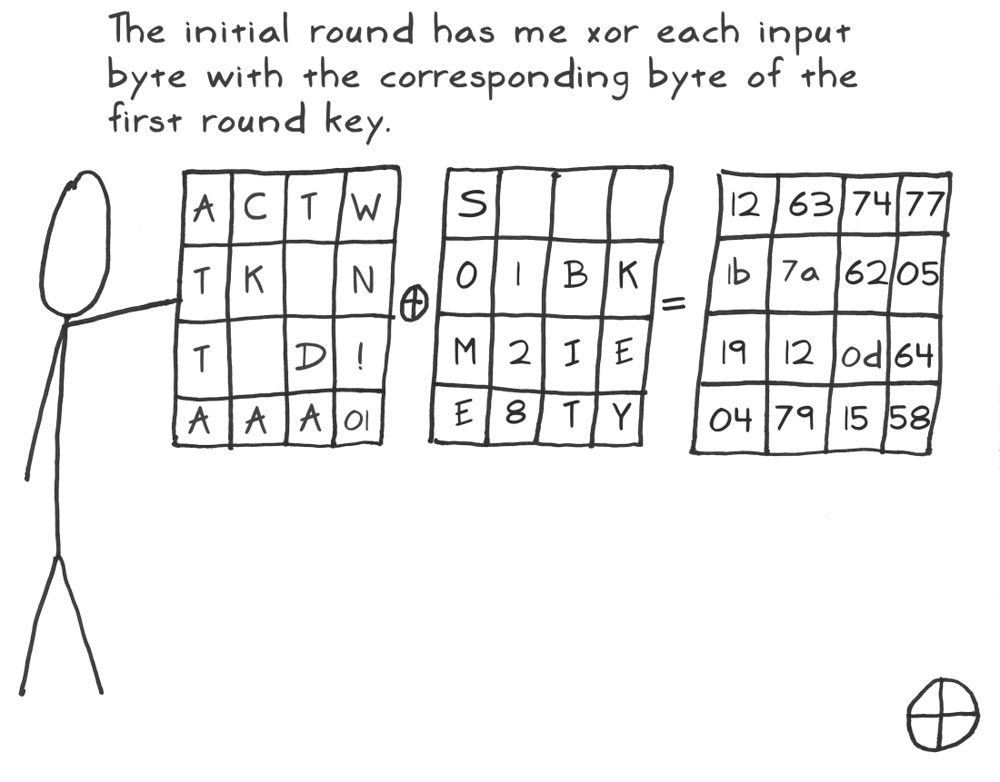
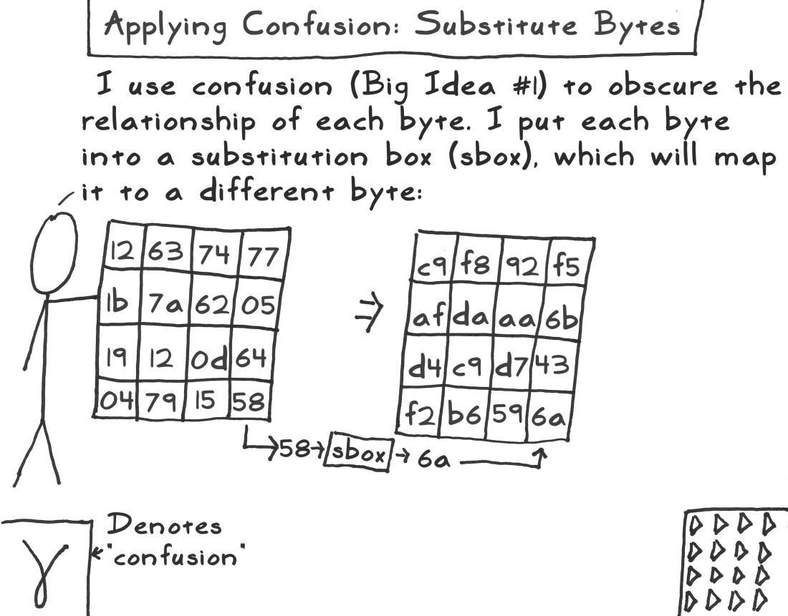
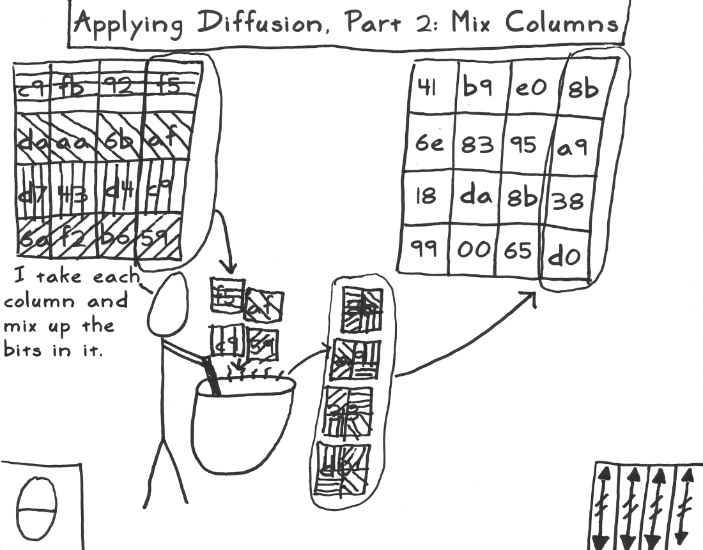
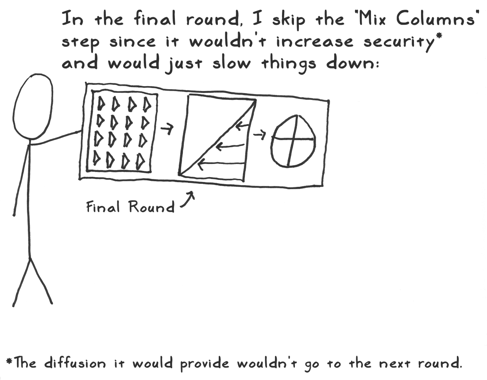
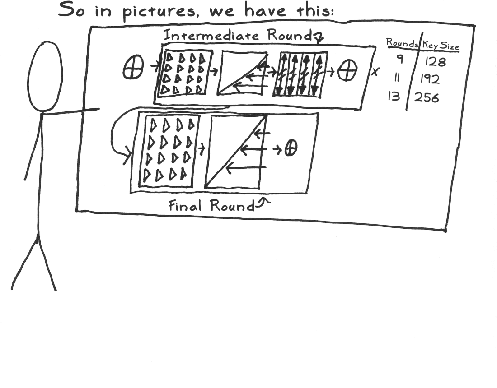

开源项目mbedtls是一个专用于嵌入式arm平台的加解密方案，包含很多算法

github仓库地址[https://github.com/ARMmbed/mbedtls](https://github.com/ARMmbed/mbedtls)
官网地址[https://tls.mbed.org/](https://tls.mbed.org/)

# AES算法原理
AES(Advanced Encryption Standard，高级加密标准)算法属于对称加密算法，几个关键概念
* 分组密码体制
* Padding
* 密钥
* 初始向量
* 加密模式

## 分组密码体制
首先把明文拆分成一个个小段，对每个小段单独加密，最后再把每个加过密的小段拼起来，就是密文。拆分小段需要遵循字节对齐，每个小段长度必须为128bit(16字节)、196bit(24字节)或者256bit(32字节)

## Padding
把明文末尾不满足字节对齐的最后一小段进行填充，有PKCS5、PKCS7和NOPADDING三种方式。PKCS5指分组缺少几个字节，就在数据末尾填充几个几，例如缺少3个字节，就在末尾填充3个3；PKCS7是指分组数据缺少几个字节，就在数据的末尾填充几个字节的0；NoPadding是指不需要填充，认为数据是填充好的

## 密钥
密钥长度与分组长度一致，位数越高，安全性越好，但是效率越低

## 初始向量
初始向量可以使得加密更加安全，需要通信双方固定好，初始向量在分组加密过程中重复被利用，初始向量首先和第一个分组进行计算，结果将作为下一个分组的初始向量。其长度规定为16字节

## 加密模式
加密模式有5种
* 电码本模式(Electronic Codebook Boo, ECB)
* 密码分组链接模式(Cipher Block Chaining, CBC)
* 计算器模式(Counter, CTR)
* 密码反馈模式(Cipher FeedBack, CFB)
* 输出反馈模式(Output FeedBack, OFB)

## 加密流程
加密的核心步骤是4个操作：密钥扩展、初始轮、重复轮和最终轮

### 密钥扩展
密钥扩展是指根据初始密钥生成后面10轮密钥的操作；AES通过一个简单地快速混合，生成10轮密钥，加上原本的密钥，一共是11轮密钥，每一轮都是依据前一轮生成的，其4个步骤为：排列、置换、与轮常量异或



### 初始轮
将第一个分组放在一个4*4的矩阵种，称为状态矩阵

将状态矩阵和初始密钥进行亦或操作


### 重复轮
把字节混淆、行移位、列混乱、加轮密钥这四个操作重复执行。重复轮重复的轮数取决于密钥的长度，128位16字节的密钥重复轮推荐重复执行9次，192位密钥重复轮推荐重复执行11次，256位密钥重复轮推荐重复执行13次

重复轮每轮重复的操作包括：字节混淆、行移位、列混乱、加轮密钥
#### 字节混淆
把初始轮得到的状态矩阵经过一个置换盒，输出一个新的矩阵，叫它为字节混淆矩阵

#### 行移位
对字节混淆矩阵进行行移位，然后再按照图中的方式重新放一下字节，这样行移位就算完成，得到的新矩阵，称之为行移位矩阵

#### 列混乱
用模不可约多项式将每列混乱，得到一个新的矩阵，称之为列混乱矩阵

#### 加轮密钥
在每一轮结束的时候，把列混乱矩阵和下一轮的密钥做一下异或操作，得到一个新的矩阵，称之为加轮秘钥矩阵


### 最终轮
最终轮的操作和重复轮类似，只是没有列混乱的操作，


### 总结
每执行一次AES加密，其实内部一共进行了11轮加密，包括1个初始轮，9个拥有4个操作的重复轮，1个拥有3个操作的最终轮，才算得到密文

解密意味着加密的逆过程，只需要把加密的每个步骤倒着顺序执行就能完成解密了


注意点
* 双方必须使用一样的密钥和初始向量IV
* 双方必须使用一样的加密模式
* 双方必须使用一样的Padding模式

# 实现
分别以C语言和Java编写测试代码，测试字符串和字节序列的加密解密
## C语言
mbedtls项目已实现，只需要做一些额外的封装

`aes_string_padding()`函数用于对字符串进行填充，参数`s`是输入字符串，`c`是填充内容，`align`是对齐长度，`rlen`为返回的填充后长度，函数返回值为一个新的字符串
```C
uint8_t *aes_string_padding(uint8_t *s, char c, int align, int *rlen)
{
	int i;
	uint8_t *p;
	uint8_t *new_s;
	size_t len;
	size_t align_len;

	if ((!s) || (align <= 0))
        return NULL;

	len = strlen(s);
	if (len==align)
		align_len = align;
	else
		align_len = ((len/align)+1)*align;
	new_s = mem_alloc(align_len);
	p = new_s;
	memcpy(p, s, len);
	p += len;

	for (i=0; i<align_len-len; i++) {
		buf_push_byte(c, p);
	}
	*rlen = align_len;
	return new_s;
}
```
函数`aes_byte_padding()`用于对字节序列进行填充
```C
uint8_t *aes_byte_padding(uint8_t *buf, int buf_len, uint8_t c, int align, int *rlen)
{
	int i;
	uint8_t *p;
	uint8_t *new_buf;
	size_t align_len;

	if ((!buf) || (align <= 0))
        return NULL;
	if (buf_len==align)
		align_len = align;
	else
		align_len = ((buf_len/align)+1)*align;
	new_buf = mem_alloc(align_len);
	p = new_buf;
	memcpy(p, buf, buf_len);
	p += buf_len;
	for (i=0; i<align_len-buf_len; i++) {
		buf_push_byte(c, p);
	}
	*rlen = align_len;
	return new_buf;
}
```
函数`aes_cbc_enc_string()`是字符串加密函数，参数：
* key，密钥
* inv，初始向量
* key_len，固定密钥长度，用于填充密钥和明文
* str，字符串形式的明文
* out，返回的密文

```C
err_type aes_cbc_enc_string(uint8_t *key, uint8_t *inv, int key_len,
								   uint8_t *str, uint8_t **out)
{
	int len;
	int safe_key_len;
	int safe_inv_len;
	int safe_str_len;
	uint8_t *safe_key;
	uint8_t *safe_inv;
	uint8_t *safe_str;
	uint8_t *safe_enc;
	mbedtls_aes_context ctx;   //加密结构

	if (!key || !inv || !str || key_len<=0)
		return et_aes_enc;

	len = strlen(key);
	if (len > key_len)
		return et_aes_enc;
	len = strlen(inv);
	if (len > key_len)
		return et_aes_enc;

	log_debug("aes_cbc_enc_string in");

    // 密钥可能不满足字节对齐，填充key
	safe_key = aes_string_padding(key, ' ', key_len, &safe_key_len);
	if (!safe_key)
		goto err;

    // 初始向量可能不满足字节对齐，填充key
	safe_inv = aes_string_padding(inv, ' ', key_len, &safe_inv_len);
	if (!safe_inv)
		goto err;

    // 明文可能不满足字节对齐，填充key
	safe_str = aes_string_padding(str, ' ', key_len, &safe_str_len);
	if (!safe_str)
		goto err;

	mbedtls_aes_init(&ctx);
	safe_enc = mem_alloc_z(safe_str_len);

	printf("key:%s, len:%d\n", key, strlen(key));
	buf_dump(key, strlen(key));
	printf("\n");
	printf("safe_key:%s, len:%d\n", safe_key, strlen(safe_key));
	buf_dump(safe_key, safe_key_len);
	printf("\n");

	printf("inv:%s, len:%d\n", inv, strlen(inv));
	buf_dump(inv, strlen(inv));
	printf("\n");
	printf("safe_inv:%s, len:%d\n", safe_inv, strlen(safe_inv));
	buf_dump(safe_inv, safe_inv_len);
	printf("\n");

	printf("plain:%s, len:%d\n", str, strlen(str));
	buf_dump(str, strlen(str));
	printf("\n");
	printf("safe plain:%s, len:%d\n", safe_str, strlen(safe_str));
	buf_dump(safe_str, safe_str_len);
	printf("\n");

	mbedtls_aes_setkey_enc(&ctx, safe_key, 128);   // 设置密钥
	mbedtls_aes_crypt_cbc(&ctx, MBEDTLS_AES_ENCRYPT, safe_str_len, // 加密函数
		safe_inv, safe_str, safe_enc);

    // 打印密文内容
	printf("cipher:%s, len:%d\n", safe_enc, strlen(safe_enc));
	printf("0x%2x, cipher len %d\n", safe_enc[15], safe_str_len);
	buf_dump(safe_enc, safe_str_len);
	printf("\n");

	if (safe_key) mem_free(safe_key);
	if (safe_inv) mem_free(safe_inv);
	if (safe_str) mem_free(safe_str);

	*out = safe_enc;
	log_debug("aes_cbc_enc_string ok");
	return et_ok;

err:
	if (safe_key) mem_free(safe_key);
	if (safe_inv) mem_free(safe_inv);
	if (safe_str) mem_free(safe_str);
	if (safe_enc) mem_free(safe_enc);
	return et_aes_enc;
}
```
函数`aes_cbc_dec_string()`用于字符串解密，参数
* key，密钥
* inv，初始向量
* key_len，规定的密钥长度
* str，密文
* out，解密后的明文
```C
err_type aes_cbc_dec_string(uint8_t *key, uint8_t *inv, int key_len,
								   uint8_t *str, uint8_t **out)
{
	int len;
	int safe_key_len;
	int safe_inv_len;
	int safe_str_len;
	uint8_t *safe_key;
	uint8_t *safe_inv;
	uint8_t *safe_dec;
	mbedtls_aes_context ctx;

	if (!key || !inv || !str || key_len<=0)
		return et_aes_enc;

	len = strlen(key);
	if (len > key_len)
		return et_aes_enc;
	len = strlen(inv);
	if (len > key_len)
		return et_aes_enc;

	log_debug("aes_cbc_dec_string in");

	safe_key = aes_string_padding(key, ' ', key_len, &safe_key_len);
	if (!safe_key)
		goto err;

	safe_inv = aes_string_padding(inv, ' ', key_len, &safe_inv_len);
	if (!safe_inv)
		goto err;

	mbedtls_aes_init(&ctx);
	safe_dec = mem_alloc_z(strlen(str));

	printf("cipher:%s, len:%d\n", str, strlen(str));
	buf_dump(str, strlen(str));
	printf("\n");

	mbedtls_aes_setkey_enc(&ctx, safe_key, 128);
	mbedtls_aes_crypt_cbc(&ctx, MBEDTLS_AES_DECRYPT, strlen(str),
		safe_inv, str, safe_dec);

	printf("plain:%s, len:%d\n", safe_dec, strlen(safe_dec));
	buf_dump(safe_dec, strlen(safe_dec));
	printf("\n");		

	if (safe_key) mem_free(safe_key);
	if (safe_inv) mem_free(safe_inv);
	*out = safe_dec;
	log_debug("aes_cbc_dec_string ok");
	return et_ok;
err:
	if (safe_key) mem_free(safe_key);
	if (safe_inv) mem_free(safe_inv);
	if (safe_dec) mem_free(safe_dec);
	return et_aes_enc;
}
```
函数`aes_cbc_enc_byte()`用于字节序列加密，参数
* key，密钥
* key_len，密钥长度
* inv，初始向量
* inv_len，初始向量长度
* align，规定字节对齐长度
* buf，明文
* buf_len，明文长度
* out，输出密文
* out_len，输出密文长度
```C
err_type aes_cbc_enc_byte(uint8_t *key, int key_len,
							    uint8_t *inv, int inv_len, int align,
							    uint8_t *buf, int buf_len, uint8_t **out,
							    int *out_len)
{
   	int len;
   	int safe_key_len;
   	int safe_inv_len;
   	int safe_buf_len;
   	uint8_t *safe_key;
   	uint8_t *safe_inv;
	uint8_t *safe_buf;
	uint8_t *safe_out;
	mbedtls_aes_context ctx;

	if (!key || !inv || !buf || key_len<=0)
		return et_aes_enc;

	if (key_len > align)
		return et_aes_enc;
	if (inv_len > align)
		return et_aes_enc;

	log_debug("aes_cbc_enc_byte in");

	mbedtls_aes_init(&ctx);

	safe_key = aes_byte_padding(key, key_len, 0x0, align, &safe_key_len);
	if (!safe_key)
		goto err;

	safe_inv = aes_byte_padding(inv, inv_len, 0x0, align, &safe_inv_len);
	if (!safe_inv)
		goto err;

	safe_buf = aes_byte_padding(buf, buf_len, 0x0, align, &safe_buf_len);
	if (!safe_buf)
		goto err;

	safe_out = mem_alloc_z(safe_buf_len);

	printf("key len %d, byte:\n", key_len);
	buf_dump(key, key_len);
	printf("\n");
	printf("safe key len %d, byte:\n", safe_key_len);
	buf_dump(safe_key, safe_key_len);
	printf("\n");

	printf("inv len %d, byte:\n", inv_len);
	buf_dump(inv, inv_len);
	printf("\n");
	printf("safe inv len %d, byte:\n", safe_inv_len);
	buf_dump(safe_inv, safe_inv_len);
	printf("\n");

	printf("plain len %d, byte:\n", buf_len);
	buf_dump(buf, buf_len);
	printf("\n");
	printf("safe plain len %d, byte:\n", safe_buf_len);
	buf_dump(safe_buf, safe_buf_len);
	printf("\n");

	mbedtls_aes_setkey_enc(&ctx, safe_key, 128);
	mbedtls_aes_crypt_cbc(&ctx, MBEDTLS_AES_ENCRYPT, safe_buf_len,
		safe_inv, safe_buf, safe_out);

	printf("cipher len %d, byte:\n", safe_buf_len);
	buf_dump(safe_out, safe_buf_len);
	printf("\n");
	if (safe_key) mem_free(safe_key);
	if (safe_inv) mem_free(safe_inv);
	if (safe_buf) mem_free(safe_buf);
	*out = safe_out;
	*out_len = safe_buf_len;
	log_debug("aes_cbc_enc_byte ok");
	printf("\n");
	return et_ok;
err:
	if (safe_key) mem_free(safe_key);
	if (safe_inv) mem_free(safe_inv);
	if (safe_buf) mem_free(safe_buf);
	return et_ok;
}
```
函数`aes_cbc_dec_byte()`用于字节序列解密
```C
err_type aes_cbc_dec_byte(uint8_t *key, int key_len,
								uint8_t *inv, int inv_len, int align,
								uint8_t *buf, int buf_len, uint8_t **out,
								int *out_len)
{
   	int len;
   	int safe_key_len;
   	int safe_inv_len;
   	uint8_t *safe_key;
   	uint8_t *safe_inv;
	uint8_t *safe_out;
	mbedtls_aes_context ctx;

	if (!key || !inv || !buf || key_len<=0)
		return et_aes_enc;

	if (key_len > align)
		return et_aes_enc;
	if (inv_len > align)
		return et_aes_enc;

	log_debug("aes_cbc_dec_byte in");

	mbedtls_aes_init(&ctx);

	safe_key = aes_byte_padding(key, key_len, 0x0, align, &safe_key_len);
	if (!safe_key)
		goto err;

	safe_inv = aes_byte_padding(inv, inv_len, 0x0, align, &safe_inv_len);
	if (!safe_inv)
		goto err;

	safe_out = mem_alloc_z(buf_len);

	printf("cipher len %d, byte:\n", buf_len);
	buf_dump(buf, buf_len);
	printf("\n");

	mbedtls_aes_setkey_enc(&ctx, safe_key, 128);
	mbedtls_aes_crypt_cbc(&ctx, MBEDTLS_AES_DECRYPT, buf_len,
		safe_inv, buf, safe_out);		

	printf("plain len %d, byte:\n", buf_len);
	buf_dump(safe_out, buf_len);
	printf("\n");

	if (safe_key) mem_free(safe_key);
	if (safe_inv) mem_free(safe_inv);
	*out = safe_out;
	*out_len = buf_len;
	log_debug("aes_cbc_dec_byte ok");
	return et_ok;

err:
	if (safe_key) mem_free(safe_key);
	if (safe_inv) mem_free(safe_inv);
	if (safe_out) mem_free(safe_out);
	return et_aes_enc;
}
```
以明文"hello world"进行加密解密测试
```C
int main(int argc, char *argv[])
{
    int enc_len;
    uint8_t *enc, *dec;

	log_level(LOG_DBG);
	log_mode(LOG_TEST);

    uint8_t *str_key = "xadcdgde";
    uint8_t *str_inv = "1234567890123456";

    aes_cbc_enc_string(str_key, str_inv, KEY_LEN, str_plain, &enc);
    aes_cbc_dec_string(str_key, str_inv, KEY_LEN, enc, &dec);
    mem_free(enc);
    mem_free(dec);

    return 0;
}
```
编译运行程序，打印如下
```shell
[root@localhost aes_test]# ./bin/aes_test
 [2019/05/24 00:50:19] [DEBUG] [aes_cbc_enc_string:711 ] aes_cbc_enc_string in

key:xadcdgde, len:8
78 61 64 63 64 67 64 65

safe_key:xadcdgde        , len:16                   # 密钥长度被填充到16
78 61 64 63 64 67 64 65 20 20 20 20 20 20 20 20

inv:1234567890123456, len:16
31 32 33 34 35 36 37 38 39 30 31 32 33 34 35 36

safe_inv:1234567890123456, len:16                   # 初始向量不变
31 32 33 34 35 36 37 38 39 30 31 32 33 34 35 36

plain:hello world, len:11                       
68 65 6c 6c 6f 20 77 6f 72 6c 64

safe plain:hello world     , len:16                 # 明文长度被填充到16
68 65 6c 6c 6f 20 77 6f 72 6c 64 20 20 20 20 20

cipher:'flen:16
0x4a, cipher len 16
de 1d f9 6b 27 82 19 2f 79 88 5f 8b 95 66 be 4a     # 密文字节

 [2019/05/24 00:50:19] [DEBUG] [aes_cbc_enc_string:763 ] aes_cbc_enc_string ok


 [2019/05/24 00:50:19] [DEBUG] [aes_cbc_dec_string:797 ] aes_cbc_dec_string in

cipher:'flen:16
de 1d f9 6b 27 82 19 2f 79 88 5f 8b 95 66 be 4a

plain:hello world     , len:16
68 65 6c 6c 6f 20 77 6f 72 6c 64 20 20 20 20 20     # 密文被正确解密

 [2019/05/24 00:50:19] [DEBUG] [aes_cbc_dec_string:825 ] aes_cbc_dec_string ok
[root@localhost aes_test]#
```
以明文``进行加密解密测试
```C
int main(int argc, char *argv[])
{
    int enc_len;
    uint8_t *enc, *dec;

	log_level(LOG_DBG);
	log_mode(LOG_TEST);

    uint8_t key[KEY_LEN] = {
		0x25,0xdd,0xff,0xee,0x33,0x4c,0xfe,0x30,0x09,0xaa,0x55,0xa5,0x0c,0x97,0x66,0x13
	};

    uint8_t inv[KEY_LEN] = {
		0x78,0x97,0xee,0xea,0xa3,0x3c,0xcf,0xf8,0x8f,0xfb,0xb6,0x65,0x5c,0xc3,0xc7,0x76
	};

    uint8_t plain[10] = {
		0x03, 0x05, 0x2d, 0x1c, 0xaa, 0xe3, 0xff, 0x23, 0x17, 0x89
	};

    aes_cbc_enc_byte(key, array_size(key),
				     inv, array_size(inv), KEY_LEN,
				     plain, array_size(plain), &enc, &enc_len);
	aes_cbc_dec_byte(key, array_size(key),
					 inv, array_size(inv), KEY_LEN,
					 enc, enc_len, &dec, &enc_len);
    mem_free(enc);
    mem_free(dec);

    return 0;
}
```
编译运行程序，打印如下
```C
[root@localhost aes_test]# ./bin/aes_test
 [2019/05/24 00:54:38] [DEBUG] [aes_cbc_enc_byte:857 ] aes_cbc_enc_byte in
key len 16, byte:
25 dd ff ee 33 4c fe 30  9 aa 55 a5  c 97 66 13

safe key len 16, byte:
25 dd ff ee 33 4c fe 30  9 aa 55 a5  c 97 66 13

inv len 16, byte:
78 97 ee ea a3 3c cf f8 8f fb b6 65 5c c3 c7 76

safe inv len 16, byte:
78 97 ee ea a3 3c cf f8 8f fb b6 65 5c c3 c7 76

plain len 10, byte:                 
 3  5 2d 1c aa e3 ff 23 17 89

safe plain len 16, byte:                            # 明文长度被填充到16
 3  5 2d 1c aa e3 ff 23 17 89  0  0  0  0  0  0

cipher len 16, byte:
 8 ce a0 f0 65 ec e7 25 d8 8b d7 ae  0 ac 8a 73

 [2019/05/24 00:54:38] [DEBUG] [aes_cbc_enc_byte:908 ] aes_cbc_enc_byte ok


 [2019/05/24 00:54:38] [DEBUG] [aes_cbc_dec_byte:940 ] aes_cbc_dec_byte in
cipher len 16, byte:
 8 ce a0 f0 65 ec e7 25 d8 8b d7 ae  0 ac 8a 73

plain len 16, byte:                                 # 密文被正确解密
 3  5 2d 1c aa e3 ff 23 17 89  0  0  0  0  0  0

 [2019/05/24 00:54:38] [DEBUG] [aes_cbc_dec_byte:970 ] aes_cbc_dec_byte ok
[root@localhost aes_test]#
```

## Java
```java
package com.awokezhou.aestest;

import org.apache.commons.codec.binary.Base64;

import javax.crypto.Cipher;
import javax.crypto.spec.IvParameterSpec;
import javax.crypto.spec.SecretKeySpec;


/**
 * AES加密算法util
 * Created by steadyjack on 2018/4/21.
 */
public class AESUtils {

    private static final String EncryptAlg ="AES";

    //private static final String Cipher_Mode="AES/ECB/PKCS7Padding";
    //private static final String Cipher_Mode="AES/CBC/PKCS5Padding";
    private static final String Cipher_Mode="AES/CBC/NoPadding";

    private static final String Encode="UTF-8";

    private static final int Secret_Key_Size=16;

    private static final byte PaddingChar = ' ';

    private static final String Key_Encode="UTF-8";

    private static String ivParameter="1234567890123456";

    public static String bytesToHexString(byte[] src){
        StringBuilder stringBuilder = new StringBuilder("");
        if (src == null || src.length <= 0) {
            return null;
        }
        for (int i = 0; i < src.length; i++) {
            int v = src[i] & 0xFF;
            String hv = Integer.toHexString(v);
            if (hv.length() < 2) {
                stringBuilder.append(0);
            }
            stringBuilder.append(hv);
        }
        return stringBuilder.toString();
    }
    /**
     * AES/ECB/PKCS7Padding 加密
     * @param content
     * @param key 密钥
     * @return aes加密后 转base64
     * @throws Exception
     */
    public static String aesPKCS7PaddingEncrypt(String content, String key, String ivParameter) throws Exception {
        try {
            //Security.addProvider(new org.bouncycastle.jce.provider.BouncyCastleProvider());

            Cipher cipher = Cipher.getInstance(Cipher_Mode);
            byte[] realKey = getSecretKey(key);
            System.out.printf("密钥16进制:%s\n", bytesToHexString(realKey));
            SecretKeySpec keySpec = new SecretKeySpec(realKey, EncryptAlg);
            IvParameterSpec iv = new IvParameterSpec(ivParameter.getBytes());//使用CBC模式，需要一个向量iv，可增加加密算法的强度
            cipher.init(Cipher.ENCRYPT_MODE, keySpec, iv);
            byte[] data = cipher.doFinal(content.getBytes(Encode));
            System.out.println(String.format("密文:%s, length:%d",
                    data, data.length));
            System.out.printf("密文16进制:%s\n", bytesToHexString(data));
            String result = new Base64().encodeToString(data);
            return result;

        } catch (Exception e) {
            e.printStackTrace();
            throw new Exception("AES加密失败：content=" +content +" key="+key);
        }
    }

    /**
     * AES/ECB/PKCS7Padding 解密
     * @param content
     * @param key 密钥
     * @return 先转base64 再解密
     * @throws Exception
     */
    public static String aesPKCS7PaddingDecrypt(String content, String key, String ivParameter) throws Exception {
        try {
            //Security.addProvider(new org.bouncycastle.jce.provider.BouncyCastleProvider());
            byte[] decodeBytes = new Base64().decodeBase64(content);
            Cipher cipher = Cipher.getInstance(Cipher_Mode);
            byte[] realKey = getSecretKey(key);
            SecretKeySpec keySpec = new SecretKeySpec(realKey, EncryptAlg);
            IvParameterSpec iv = new IvParameterSpec(ivParameter.getBytes());
            cipher.init(Cipher.DECRYPT_MODE, keySpec, iv);
            byte[] realBytes=cipher.doFinal(decodeBytes);
            return new String(realBytes, Encode);
        } catch (Exception e) {
            e.printStackTrace();
            throw new Exception("AES解密失败：Aescontent = " +e.fillInStackTrace(),e);
        }
    }

    /**
     * 对密钥key进行处理：如密钥长度不够位数的则 以指定paddingChar 进行填充；
     *      * 此处用空格字符填充，也可以 0 填充，具体可根据实际项目需求做变更
     * @param key
     * @return
     * @throws Exception
     */
    public static byte[] getSecretKey(String key) throws Exception{
        final byte paddingChar=' ';

        byte[] realKey = new byte[Secret_Key_Size];
        byte[] byteKey = key.getBytes(Key_Encode);
        for (int i =0;i<realKey.length;i++){
            if (i<byteKey.length){
                realKey[i] = byteKey[i];
            }else {
                realKey[i] = paddingChar;
            }
        }

        return realKey;
    }

    public static byte[] keyPadding(String key, byte c, int size, String encode) throws Exception{
        byte[] paddingKey = new byte[size];
        byte[] bytesKey = key.getBytes(encode);
        for (int i=0; i<paddingKey.length; i++){
            if (i<bytesKey.length){
                paddingKey[i] = bytesKey[i];
            } else {
                paddingKey[i] = c;
            }
        }

        return paddingKey;
    }

    public static String textPadding(String text, byte c, int size, String encode) throws Exception{
        int len = text.length();
        byte[] paddingText = new byte[size];
        byte[] bytesText = text.getBytes(encode);
        for (int i=0; i<paddingText.length; i++){
            if (i<bytesText.length){
                paddingText[i] = bytesText[i];
            } else {
                paddingText[i] = c;
            }
        }
        String result = new String(paddingText);
        return result;
    }

    public static void main(String[] args) throws Exception {
        //密钥 加密内容(对象序列化后的内容-json格式字符串)

        String key = "xadcdgde";
        String encPlainText = "hello world";
        System.out.println(String.format("明文:%s, length:%d",
                encPlainText, encPlainText.length()));
        encPlainText = textPadding(encPlainText, PaddingChar, Secret_Key_Size, Encode);
        System.out.printf("明文16进制:%s\n", bytesToHexString(encPlainText.getBytes()));
        String cipherText = aesPKCS7PaddingEncrypt(encPlainText, key, ivParameter);

        String decPlainText = aesPKCS7PaddingDecrypt(cipherText, key, ivParameter);
        System.out.println(String.format("解密:%s, length:%d",
                decPlainText, decPlainText.length()));
    }
}
```
运行代码，打印为
```cmd
明文:hello world, length:11
明文16进制:68656c6c6f20776f726c642020202020
密钥16进制:78616463646764652020202020202020
密文:[B@2b2948e2, length:16
密文16进制:de1df96b2782192f79885f8b9566be4a
解密:hello world     , length:16
```
java密文与C语言密文16进制内容一致
