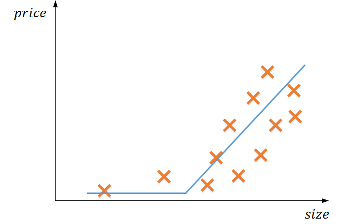
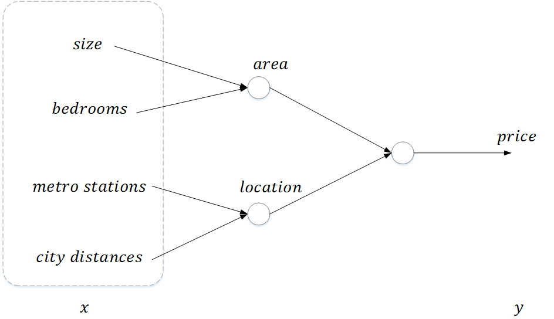
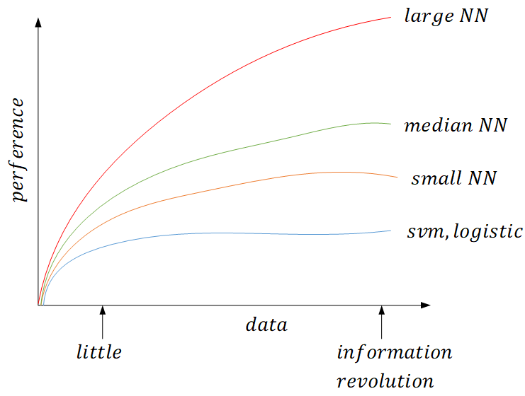

## 课程内容
* Neural Network and Deep Learning
* Improving Deep Neural Network: Hyperparamter tuning, Regularization and Optimization
* Structuring your Machine Learning project
* Convolutional Network Network
* Natural Language Processing: Build sequence models. (RNN, LSTM)

## 什么是神经网络
以预测房价为例，下图显示的是房价 $price$ 和房屋面积 $size$ 之间的关系

使用线性拟合可以得到一条蓝色曲线，该曲线类似一个线性整流单元(ReLU, Rectified Linear Unite)。ReLU是神经网络中激活函数的一种，关于ReLU和激活函数在后续内容再做介绍，此处先不做过多解释。我们用一个神经元来表示输入和输出的关系

这个神经元就是ReLU。如果增加更多的特征，一个神经元不足以表示特征和输出的关系，则需要增加神经元个数

可以理解，房屋大小和卧室数量决定的是房屋面积，地铁站数量和距离市中心远近决定的是房屋位置，而更深层的神经元是综合考量。其实不需要人为标定每个神经元的作用，而完全可以只输入特征，让神经元自己学习和决定。当给定足够的训练数据$(x,y)$，神经网络能够很好的拟合出$x,y$之间的映射关系

## 用神经网络进行监督学习
神经网络属于监督学习范畴，即必须给定输入和输出的对应训练数据，网络基于此进行学习。神经网络的学习对象可以是结构化数据，也可以是非结构化数据。例如用户推荐系统利用公司数据库中用户的结构化信息如年龄、购买力、兴趣等数据进行学习，并向用户推荐所好；非结构化数据指的是不同于结构化数据，有完整的数据结构和成员，而只是一段数据序列，例如音频文件、文本文件、图片中的数据流，神经网络同样能够进行学习

## 深度神经网络为什么会快速兴起
深度神经网络的兴起可以用下图来说明

横轴表示数据规模，纵轴表示学习算法的性能。对于传统算法例如SVM、Logistic、随机森林等算法而言，在早期数据量较小的情况下，能够获得不错的性能，但这些算法不知道如何处理更大规模的数据，当性能到达某个瓶颈后，再增加数据量并不能提高算法性能

神经网络算法并不是近几年来的新发现，很早就已经提出。但是由于近年来电子信息技术的发展，数据的产生呈爆炸式发展，数据的产生、存储、处理、通信能力和速度都得到了极大提升，而神经网络算法能够不断地从新数据中学习，这种学习能力随着数据规模迅速增长。小型的神经网络在大量数据的训练中已经能够超过传统算法很多，而最前沿的超大规模数据+超大规模神经网络的组合已经能够取得非常好的性能
