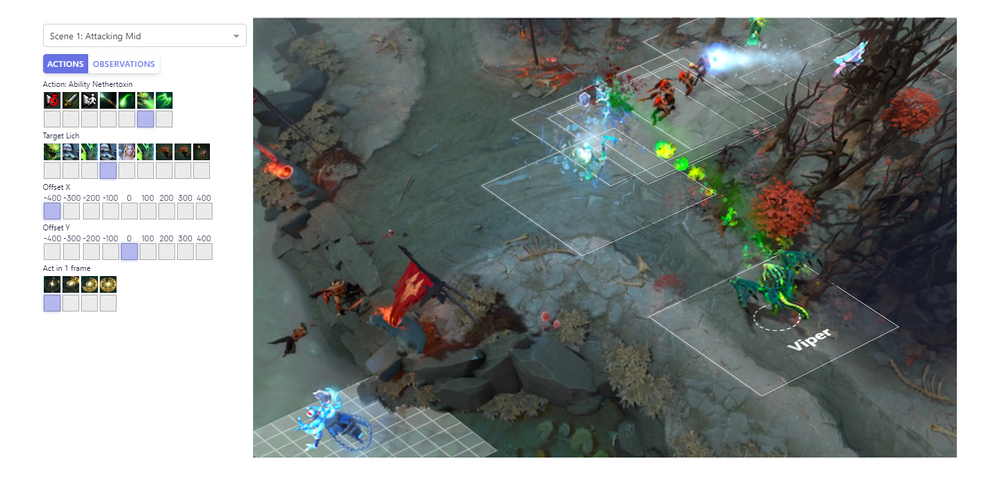
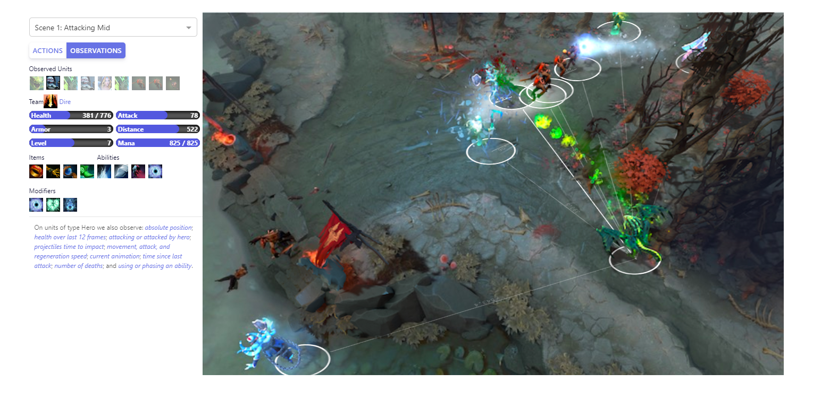
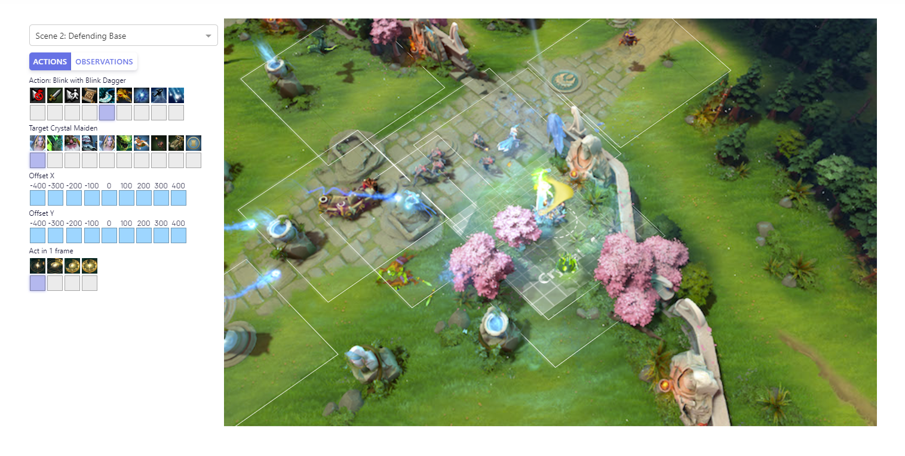
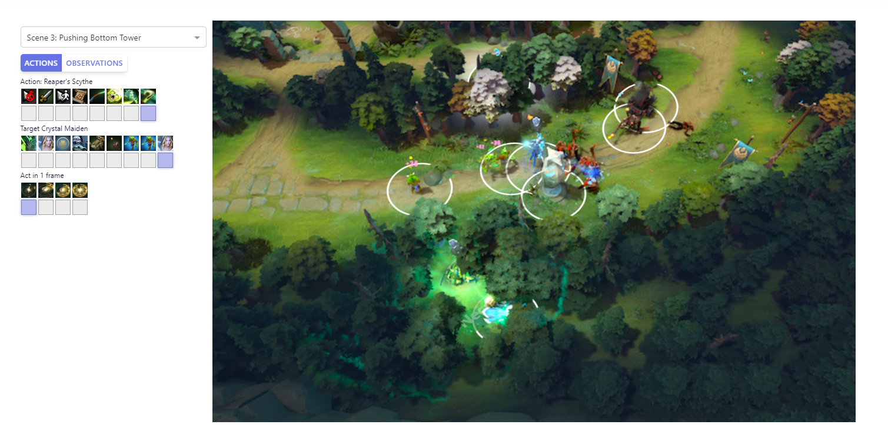
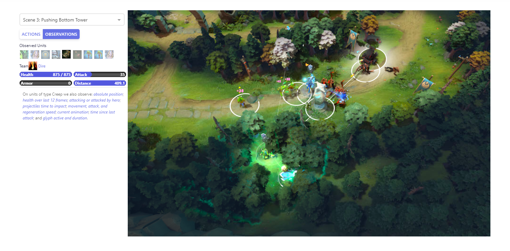
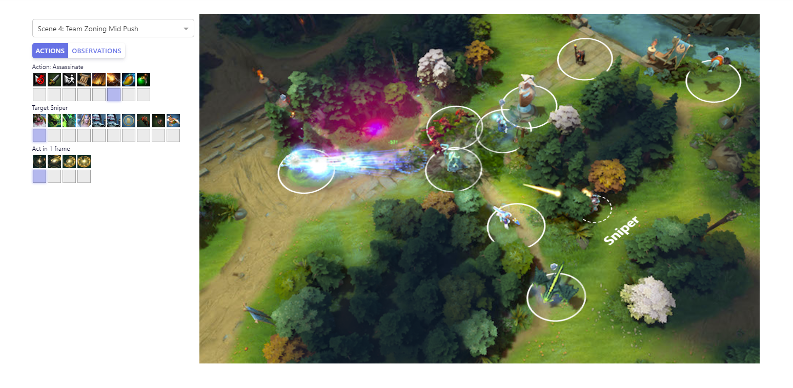
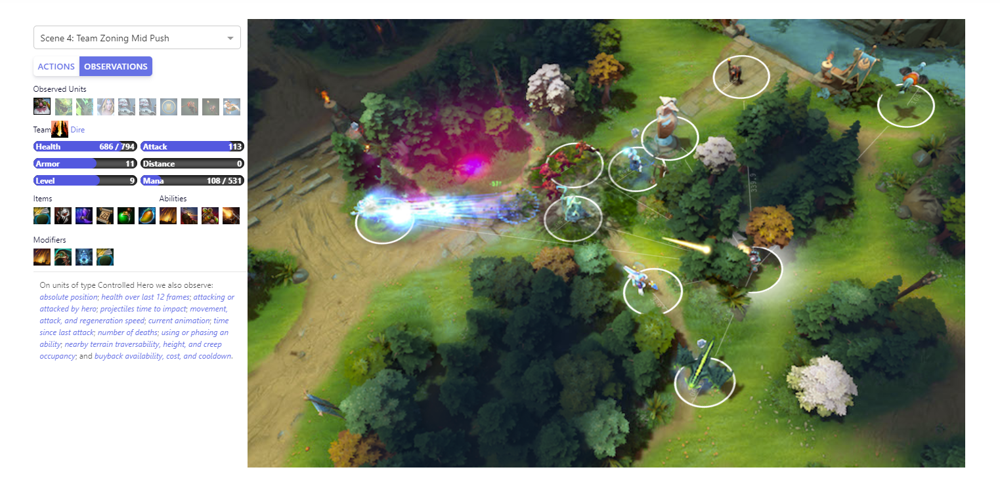

待续~

我们的OpenAI Five神经网络团队，已经开始击败业余的Dota2人类团队。虽然今天我们仍然存在一些限制，但我们的目标是在今年8月份的国际邀请赛上在有限的英雄上击败一只顶尖的专业战队。我们不一定会成功：dota 2是世界上最受欢迎和最复杂的电子竞技游戏之一，拥有富有创造力和积极性的专业人士，他们全年都在训练，以赢得dota每年4000万美元奖金池(所有电子竞技游戏中最大的一个)的一部分

OpenAI Five每天能够学习和它自己对战180年的有效游戏。它在一个放大版的[PPO(Proximal Policy Optimization)](https://openai.com/blog/openai-baselines-ppo/)上训练，有256个GPU和128000个CPU。对每个英雄使用一个单独的LSTM，不使用人类数据，它学习可识别的策略

为了衡量我们的程序，我们将在8月5日举办一场与顶级战队的比赛

## 问题
人工智能的一个里程碑是在复杂的电子游戏中超越人类的能力，比如星际争霸或DOTA。与以前的人工智能里程碑(如象棋或围棋)相比，复杂的电子游戏开始捕捉现实世界的混乱和连续性。我们希望能够解决复杂电子游戏的系统是高度通用的，能够应用于游戏之外

Dota2是一款两个队伍各五名队员的实时策略性游戏，每个选手控制一个英雄。能够玩Dota的AI必须掌握以下内容：

* **长时间范围** Dota游戏以每秒30帧运行，平均每局45分钟，大概8000个时间点。大多数动作(比如命令英雄移动到某个地点)都会产生独立的轻微影响，但是一些独立的动作会在影响游戏的战略走向，例如TP；有些策略可以在整个游戏中发挥作用。OpenAI每4帧观察一次，产生2000次移动。象棋通常在40步之前结束，围棋一般是150步之内，每一步都是战略性的
* **局部观察状态** 单位和建筑物只能看到它们附近的区域。地图的其余部分被大雾笼罩，隐藏着敌人及其战略。赢得游戏需要根据不完整的数据做出推论，以及模拟对手可能要做的事情。下棋和围棋都是全信息游戏
* **高维连续动作空间** 在DOTA中，每个英雄可以采取几十个行动，许多行动针对的是另一个单位或地面上的一个位置。我们将空间离散为每个英雄17万个可能的动作(并非所有的每一个勾选都有效，例如在冷却时使用法术)；不计算连续部分，平均每个时间点有1000个有效动作。象棋和围棋的平均动作数是35和250
* **高维连续观测空间** Dota是在一张连续的大地图上玩的，地图上有十个英雄、几十个建筑物、几十个NPC单位、符文、树木、防御区等。我们的模型通过V社的bot API观察到一个Dota游戏的状态，即20000个(大部分是浮点)数字代表一个人可以访问的所有信息。一个象棋棋盘表示为大约70个枚举值(一个由6个棋子类型和次要历史信息组成的8x8棋盘)；围棋棋盘大约400个枚举值

Dota规则也非常复杂——游戏已经开发了十多年，游戏逻辑在数十万行代码中实现。这种逻辑每执行一个标记需要毫秒，而国际象棋或围棋引擎则需要纳秒。游戏每两周更新一次，不断改变环境语义

## 我们的方法
我们的系统学习使用大规模的PPO。Openai Five和我们早期的1v1机器人都完全是从自我游戏中学习的，它们从随机参数开始，不使用搜索或从人类replay中学习

|                                     | OPENAI 1V1 BOT            | OPENAI FIVE                                                             |
|-------------------------------------|---------------------------|-------------------------------------------------------------------------|
| CPUs                                | 60,000 CPU cores on Azure | 128,000 preemptible CPU cores on GCP                                    |
| GPUs                                | 256 K80 GPUs on Azure     | 256 P100 GPUs on GCP                                                    |
| 收集经验                | ~300 years per day        | ~180 years per day \(~900 years per day counting each hero separately\) |
| 观测规模                 | ~3\.3 kB                  | ~36\.8 kB                                                               |
| 每秒游戏观察数 | 10                        | 7\.5                                                                    |
| 批量大小                          | 8,388,608 observations    | 1,048,576 observations                                                  |
| 每分钟批量数                  | ~20                       | ~60                                                                     |

RL研究人员(包括我们自己)普遍认为，长时间范围学习需要从根本上取得新的进展，例如分层强化学习。我们的结果表明，我们没有给予今天的算法足够的信任——至少当它们以足够的规模运行并且有合理的探索方法时

我们的代理被训练为最大化未来报酬的指数衰减总和，用一个称为γ的指数衰减因子进行加权。在最新的Openai Five训练中，我们将γ从0.998(以46秒的半衰期评估未来奖励)退火到0.9997(以5分钟的半衰期评估未来奖励)。相比之下，PPO纸中最长的地平线是0.5秒的半衰期，彩虹纸中最长的地平线是4.4秒的半衰期，观察和进一步观察纸使用46秒的半衰期

虽然目前版本的Openai Five在最后一次攻击时很弱(观察我们的测试赛，专业的Dota评论员blitz估计它大约是Dota玩家的中位数)，但它的目标优先级符合一个通用的专业策略。获得长期奖励，如战略地图控制，往往需要牺牲短期奖励，如从农业中获得的黄金，因为分组攻击塔需要时间。这一观察加强了我们的信念，即系统确实是在长期优化


<iframe width="720" height="405" src="https://www.youtube.com/embed/UZHTNBMAfAA" frameborder="0" allow="accelerometer; autoplay; encrypted-media; gyroscope; picture-in-picture" allowfullscreen></iframe>


### 模型结构
Openai Five的每个网络都包含一个单层的1024单元的LSTM，它可以看到当前的游戏状态(从V社的bot API中提取)，并通过几个可能的动作头发出动作。每个头部都具有语义意义，例如，延迟此动作的节拍数、要选择的动作、该动作在单位周围网格中的X或Y坐标等。动作头部是独立计算的。

Openai Five使用的观察空间和行动空间的交互演示。OpenAIFive将世界视为20000个数字的列表，并通过发出8个枚举值的列表来执行操作。选择不同的行动和目标，了解OpenAIFive如何编码每个行动，以及它如何观察世界。这幅图像显示了一个人类看到的场景

OpenAI Five可以对与它所看到的相关的缺失状态片段做出反应。例如，直到最近，Openai Five的观测还没有包括弹片区(弹丸落在敌人身上的区域)，人是可以显而易见看到的。然而，我们观察到Openai Five正在学习走出(尽管不能避免进入)主动弹片区，因为它可以看到它的健康在下降

### 探索
给出了一个能够处理长视距的学习算法，我们仍然需要探索环境。即使有了我们的限制，仍然有数百个物品、几十个建筑、法术和单位类型，以及一个需要学习的游戏机制的长尾——其中许多都会产生强大的组合。有效地探索这个组合广阔的空间并不容易

Openai Five通过自己和自己对战学习(从随机权重开始)，为探索和学习提供了一个很自然的环境。为了避免“战略崩溃”，代理训练80%的游戏与自己对抗，另外20%与过去的自己对抗。在第一场比赛中，英雄们漫无目的地在地图上走来走去。经过几个小时的训练，诸如farm或中途战斗等概念应运而生。几天之后，他们一直采用基本的人类策略：试图从对手那里偷取赏金符文，走到他们的一级塔去野区farm，并围绕地图游走以获得优势。经过进一步的训练，他们能够熟练运用5英雄推进等高级策略。

在2017年3月，我们的第一个代理打败了机器人，但与人类混淆了。为了在战略空间进行强行探索，在训练期间(并且仅在训练期间)，我们随机化了部队的属性(健康、速度、起始水平等)，然后开始击败人类。后来，当一个测试玩家持续击败我们的1v1机器人时，我们增加了我们的训练随机化，测试玩家开始输了。我们的机器人团队同时将类似的随机化技术应用于物理机器人，以从模拟转移到现实世界

OpenAI Five使用我们为1v1机器人编写的随机化方法。它还使用了新的分路方法。在每一个训练游戏开始时，我们随机“分配”每个英雄到一些道路的子集，并惩罚它从这些道路偏离直到游戏中随机选择的时间

好的奖励也有助于探索。我们的奖励主要是由人类跟踪以决定他们在游戏中的表现的指标组成：净值、杀戮、死亡、助攻、最后一击等等。我们通过减去其他团队的平均奖励来对每个代理的奖励进行后处理，以防止代理发生正和情况。我们对项目和技能构建进行硬编码(最初是为我们的脚本基线编写的)，并随机选择要使用的构建。Courier管理也从脚本化基线导入

### 协作
OpenAI Five不包含英雄神经网络之间的明确通信通道。团队合作是由我们称之为“团队精神”的超参数控制的。团队精神的范围从0到1，这就决定了Openai Five的英雄们应该关心他们各自的奖励功能，而不是团队的平均奖励功能。我们通过训练将其值从0退火到1

### Rapid
我们的系统是一个通用的RL培训系统，称为Rapid，可应用于任何Gym环境。我们已经使用了快速解决其他问题在OpenAI，包括竞争自我发挥

