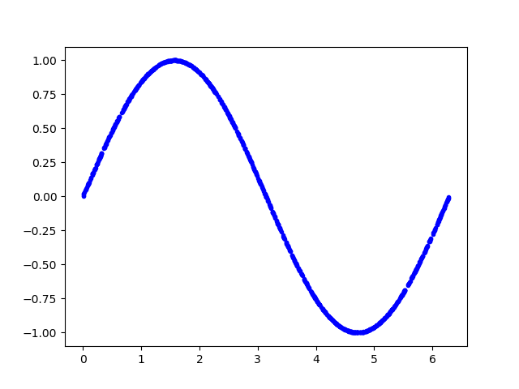
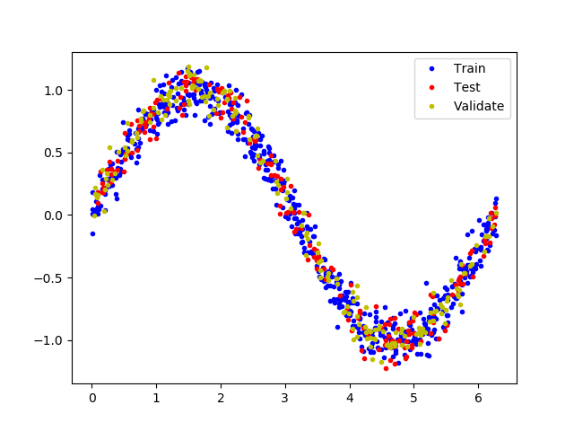
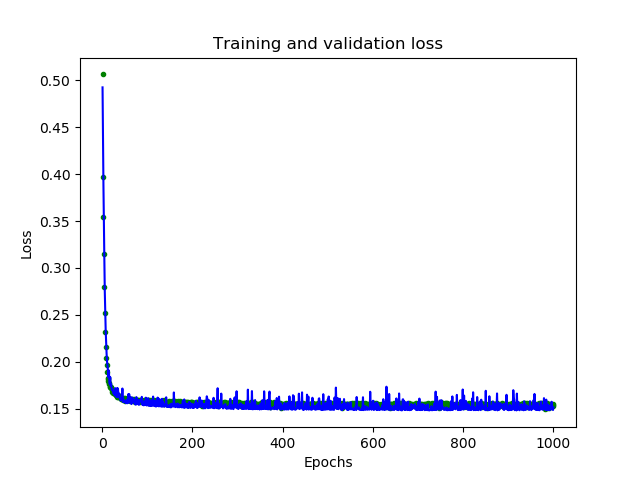
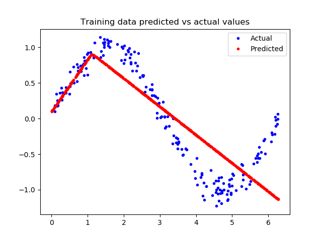
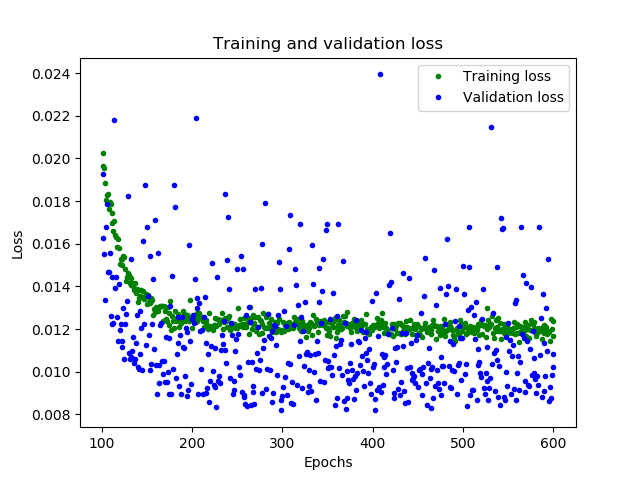
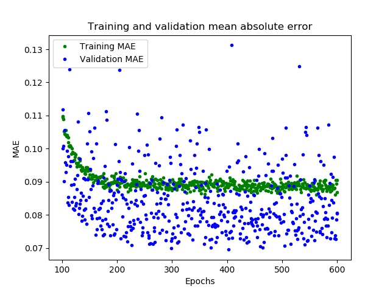
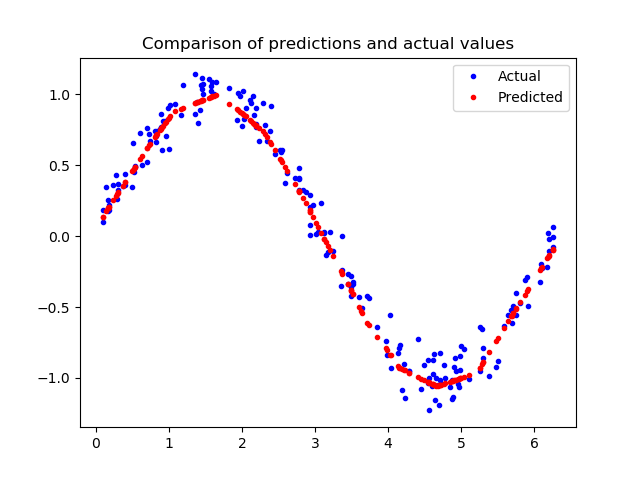
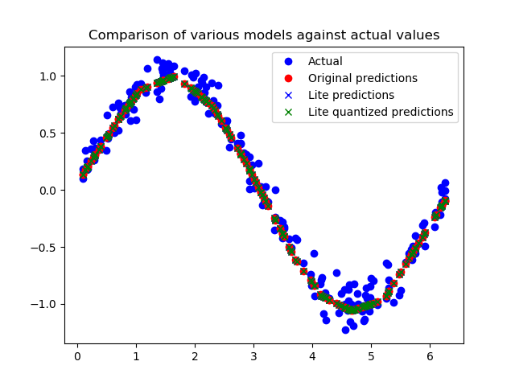
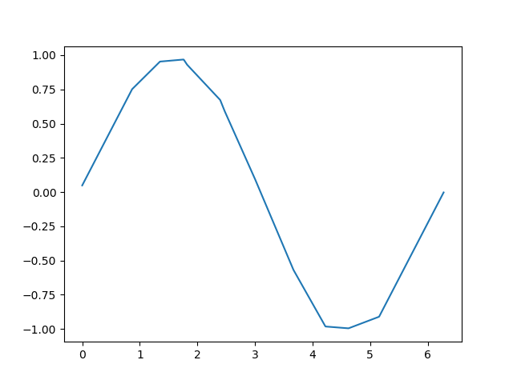

本文基于定制化的TFLite Micro动态链接库，通过"hello world"示例来验证TFLite Micro版本的功能。虽然名字叫是"hello world"，其实并不是在控制台上打印出"hello world"这么简单，而是用Python版本的Tensorflow构建训练一个能够学习并生成正弦波的模型，通过TFLite的转换器转换为.tflite文件，并使用TFLite Micro动态链接库加载并执行推断的过程

开发环境

* Inter i5-7200U

* Ubuntu18.04.2 x86_64

* conda Python3.7虚拟环境

* Tensorflow2.1.0

参考

* [http://tensorflow.google.cn/](http://tensorflow.google.cn/)

* tensorflow/tensorflow/lite/micro/examples/hello_world/create_sine_model.ipynb

## 生成数据

首先需要加载一些python库

```python
import tensorflow as tf
import numpy as np
import matplotlib.pyplot as plt
import math
```

以下代码生成一组随机数，并计算它们的正弦值，并绘图显示

```python
SAMPLES = 1000
np.random.seed(1337)
x_values = np.random.uniform(low=0, high=2*math.pi, size=SAMPLES)
np.random.shuffle(x_values)
y_values = np.sin(x_values)
plt.plot(x_values, y_values, 'b.')
plt.show()
```



## 添加噪声

由于数据是由正弦函数直接生成，数据太过平滑。然而现实中获取的各种信号必然夹杂着噪声数据，而机器学习算法能够从带有噪声的数据中学习到真正的信息

为数据添加一些噪声，并绘制显示

```python
y_values += 0.1 * np.random.randn(*y_values.shape)
plt.plot(x_values, y_values, 'b.')
plt.show()
```


## 拆分数据

我们已经生成了一个近似真实世界的噪声数据，我们用它来训练模型

为了验证评估模型，以及防止数据的过拟合，我们将数据拆分为训练集、测试集和验证集3部分，比例为3:1:1

以下代码将数据分割，并以不同的颜色显示

```python
TRAIN_SPLIT =  int(0.6 * SAMPLES)
TEST_SPLIT = int(0.2 * SAMPLES + TRAIN_SPLIT)
x_train, x_test, x_validate = np.split(x_values, [TRAIN_SPLIT, TEST_SPLIT])
y_train, y_test, y_validate = np.split(y_values, [TRAIN_SPLIT, TEST_SPLIT])
plt.plot(x_train, y_train, 'b.', label="Train")
plt.plot(x_test, y_test, 'r.', label="Test")
plt.plot(x_validate, y_validate, 'y.', label="Validate")
plt.legend()
plt.show()
```



## 设计模型

我们将建立一个模型，它接收一个输入，并用它来预测一个输出，此类问题称为回归问题。为了达到这个目的，我们将创建一个简单的神经网络，它将使用多层的神经元来学习数据背后的模式，以便进行预测

首先，我们定义两个层。第一层接收一个输入，并经过16个神经元。输入到来时，每个神经元将根据自身的权重和偏置状态受到不同程度的激活，神经元的激活程度由数字表示。第一层的激活将作为第二层的输入，第二层的输出作为模型的输出值

我们使用Keras来定义模型，模型使用"relu"作为激活函数，优化器使用"rmsprop"，损失函数使用"mse"，使用MAE来评估

```python
from tensorflow.keras import layers
model_1 = tf.keras.Sequential()
model_1.add(layers.Dense(16, activation='relu', input_shape=(1,)))
model_1.add(layers.Dense(1))
model_1.compile(optimizer='rmsprop', loss='mse', metrics=['mae'])
```

## 训练模型

一旦我们定义好了模型，可以使用数据来训练它。训练过程将x输入到网络中，检查网络输出与原始数据的偏离程度，并调整神经元的偏置和权重。训练过程是在整个数据上多次运行，每次完整的运行都称为"epoch"。在每个"epoch"中，数据以多批次的方式在网络中运行，每一批次都有几个数据进入网络并输出，对网络参数的调整是以一个批次为单位的。"epoch"次数和批次大小都可以通过参数调整

以下代码运行1000个"epoch"，每个批次16个数据，还传递一些数据用于验证。整个训练需要一定的时间

```python
history_1 = model_1.fit(x_train, y_train, epochs=1000, batch_size=16,
                    validation_data=(x_validate, y_validate))
```

## 模型评估

在训练期间，模型的性能在数据迭代中不断的提升，训练会生成一个日志，告诉我们性能在训练过程中是如何变化的。以下代码将以图形形式显示其中一些信息

```python
loss = history_1.history['loss']
val_loss = history_1.history['val_loss']
epochs = range(1, len(loss) + 1)
plt.plot(epochs, loss, 'g.', label='Training loss')
plt.plot(epochs, val_loss, 'b', label='Validation loss')
plt.title('Training and validation loss')
plt.xlabel('Epochs')
plt.ylabel('Loss')
plt.legend()
plt.show()
```



图形中显示了每个epoch的损失函数情况。有多种方式的损失函数，这里我们使用的是均方误差MSE。损失函数在前25个epoch迅速减少，之后趋于平缓，这意味着模型在不断改进。我们的目标是当模型不再改进，或者当训练损失小于验证损失时，意味着学习已经收敛，需要停止训练。为了更清楚的观察平坦部分，我们跳过前50个epoch的训练情况

```python
SKIP = 50
plt.plot(epochs[SKIP:], loss[SKIP:], 'g.', label='Training loss')
plt.plot(epochs[SKIP:], val_loss[SKIP:], 'b.', label='Validation loss')
plt.title('Training and validation loss')
plt.xlabel('Epochs')
plt.ylabel('Loss')
plt.legend()
plt.show()
```


从上图中可以看出，损失在前600个epoch持续减少，到600之后不再变化，这意味着600之后的训练是没有必要的。同时，我们也可以看到，最低的损失函数值仍然在0.155左右，这意味着我们的网络预测平均偏离了15%。另外，验证损失值跳变很多。为了了解更多模型的性能，我们可以绘制更多数据，这次我们输出MAE平均绝对误差，这是测量网络预测与实际之间差距距离的另一种方法

```python
plt.clf()
mae = history_1.history['mae']
val_mae = history_1.history['val_mae']
plt.plot(epochs[SKIP:], mae[SKIP:], 'g.', label='Training MAE')
plt.plot(epochs[SKIP:], val_mae[SKIP:], 'b.', label='Validation MAE')
plt.title('Training and validation mean absolute error')
plt.xlabel('Epochs')
plt.ylabel('MAE')
plt.legend()
plt.show()
```


这幅图告诉了我们更多的信息。训练数据的MAE始终低于验证数据的MAE，这意味着网络可能有过拟合，或者学习训练数据太僵硬，以至于无法对新数据做出有效预测。此外，MAE整体都较高，最多为0.305，这表明模型的预测有30%的偏差。为了更清楚的了解到发生了什么，我们可以将网络预测值和实际训练值进行比较

```python
predictions = model_1.predict(x_train)
plt.clf()
plt.title('Training data predicted vs actual values')
plt.plot(x_test, y_test, 'b.', label='Actual')
plt.plot(x_train, predictions, 'r.', label='Predicted')
plt.legend()
plt.show()
```



这张图表明网络已经学会以非常有限的方式逼近正弦函数，但是这是一个线性的逼近。这种拟合的刚性表明，该模型没有足够的能力来学习正弦波函数的全部复杂性，因此只能用过于简单的方法来近似它。我们可以修改模型，来改进性能

## 改变模型

再增加一层神经元，以下增加一个16个神经元的层

```python
model_2 = tf.keras.Sequential()
model_2.add(layers.Dense(16, activation='relu', input_shape=(1,)))
model_2.add(layers.Dense(16, activation='relu'))
model_2.add(layers.Dense(1))
model_2.compile(optimizer='rmsprop', loss='mse', metrics=['mae'])
```

我们现在将训练新模型。为了节省时间，我们只训练600个epoch

```python
history_2 = model_2.fit(x_train, y_train, epochs=600, batch_size=16,
                    validation_data=(x_validate, y_validate))
```

## 再次评估模型

可以看到，模型已经有了很大改进，验证损失从0.15降到0.015，验证MAE从0.31降低到0.1

以下代码显示新模型训练的情况

```python
loss = history_2.history['loss']
val_loss = history_2.history['val_loss']
epochs = range(1, len(loss) + 1)
plt.plot(epochs, loss, 'g.', label='Training loss')
plt.plot(epochs, val_loss, 'b', label='Validation loss')
plt.title('Training and validation loss')
plt.xlabel('Epochs')
plt.ylabel('Loss')
plt.legend()
plt.show()

SKIP = 100
plt.clf()
plt.plot(epochs[SKIP:], loss[SKIP:], 'g.', label='Training loss')
plt.plot(epochs[SKIP:], val_loss[SKIP:], 'b.', label='Validation loss')
plt.title('Training and validation loss')
plt.xlabel('Epochs')
plt.ylabel('Loss')
plt.legend()
plt.show()

plt.clf()
mae = history_2.history['mae']
val_mae = history_2.history['val_mae']
plt.plot(epochs[SKIP:], mae[SKIP:], 'g.', label='Training MAE')
plt.plot(epochs[SKIP:], val_mae[SKIP:], 'b.', label='Validation MAE')
plt.title('Training and validation mean absolute error')
plt.xlabel('Epochs')
plt.show()
```






很好的结果，从图中可以看到一些令人兴奋的事情

* 我们的网络已经更快地达到了它的最高精度(在200个epoch而不是600个)

* 总的损失和MAE比之前的网络好得多

* 验证误差比训练误差更小，这意味着网络并没有过拟合

让我们对照模型的预测值和训练数据

```python
loss = model_2.evaluate(x_test, y_test)
predictions = model_2.predict(x_test)
plt.clf()
plt.title('Comparison of predictions and actual values')
plt.plot(x_test, y_test, 'b.', label='Actual')
plt.plot(x_test, predictions, 'r.', label='Predicted')
plt.legend()
plt.show()
```



由上图看出，预测结果与我们的数据非常吻合。这个模型并不完美，它的预测并没有形成一个平滑的正弦曲线，如果我们想更进一步，我们可以尝试进一步增加模型的容量，也许可以使用一些技术来防止过度拟合。然而，机器学习的一个重要部分是知道什么时候停止，这个模型对于我们示例来说已经足够好了

## 转换模型到TFLite

将模型用于TFLite微控制器，需要将其转换为正确的格式，为此我们将使用Tensorflow Lite转换器，转换器可以以一种特殊的、节省空间的格式将模型输出到文件。由于是部署到微控制器上，我们希望它尽可能小，可以通过量化的方法减小尺寸。它降低了模型权重的精度，以节省内存。因为量化模型更小，因此运行起来也更快

转换器可以在转换时选择是否进行量化

```python
converter = tf.lite.TFLiteConverter.from_keras_model(model_2)
tflite_model = converter.convert()

open("sine_model.tflite", "wb").write(tflite_model)
converter = tf.lite.TFLiteConverter.from_keras_model(model_2)
converter.optimizations = [tf.lite.Optimize.OPTIMIZE_FOR_SIZE]
tflite_model = converter.convert()

open("sine_model_quantized.tflite", "wb").write(tflite_model)
```

执行以上代码可以看到，未量化的模型大小为2732KB，量化模型大小为2720KB

## 测试转换后的模型

为了证明这些模型在转换和量化之后仍然是准确的，我们将使用这两个模型进行预测，并将其与我们的测试结果进行比较：

```python
sine_model = tf.lite.Interpreter('sine_model.tflite')
sine_model_quantized = tf.lite.Interpreter('sine_model_quantized.tflite')
sine_model.allocate_tensors()
sine_model_quantized.allocate_tensors()
sine_model_input = sine_model.tensor(sine_model.get_input_details()[0]["index"])
sine_model_output = sine_model.tensor(sine_model.get_output_details()[0]["index"])
sine_model_quantized_input = sine_model_quantized.tensor(sine_model_quantized.get_input_details()[0]["index"])
sine_model_quantized_output = sine_model_quantized.tensor(sine_model_quantized.get_output_details()[0]["index"])
sine_model_predictions = np.empty(x_test.size)
sine_model_quantized_predictions = np.empty(x_test.size)
for i in range(x_test.size):
    sine_model_input().fill(x_test[i])
    sine_model.invoke()
    sine_model_predictions[i] = sine_model_output()[0]
    sine_model_quantized_input().fill(x_test[i])
    sine_model_quantized.invoke()
    sine_model_quantized_predictions[i] = sine_model_quantized_output()[0]
plt.clf()
plt.title('Comparison of various models against actual values')
plt.plot(x_test, y_test, 'bo', label='Actual')
plt.plot(x_test, predictions, 'ro', label='Original predictions')
plt.plot(x_test, sine_model_predictions, 'bx', label='Lite predictions')
plt.plot(x_test, sine_model_quantized_predictions, 'gx', label='Lite quantized predictions')
plt.legend()
plt.show()
```



从图中我们可以看出，对原始模型、转换模型和量化模型的预测都非常接近，无法区分。这意味着我们的量化模型已经可以使用了！

## 使用C++程序执行推断

这里使用C++程序需要依赖TFLite Micro动态链接库，参见[]()

通过xxd命令将模型文件转换为C++源文件

```shell
xxd -i sine_model_quantized.tflite > sine_model_quantized.cc
```

可以看到生成的C++文件中，模型是以字节序列存放的，并通过sine_model_quantized.h文件向外暴露模型地址和长度

```cpp
unsigned char sine_model_quantized_tflite[] = {
  0x18, 0x00, 0x00, 0x00, 0x54, 0x46, 0x4c, 0x33, 0x00, 0x00, 0x0e, 0x00,
  0x18, 0x00, 0x04, 0x00, 0x08, 0x00, 0x0c, 0x00, 0x10, 0x00, 0x14, 0x00,
  ......
}

unsigned int sine_model_quantized_tflite_len = 2640;
```

我们创建一个main.cc源文件，用来加载模型并循环执行推断，将模型输出导出到csv文件中，最后用python绘图呈现模型的预测效果

### 引用一些头文件

TFLite Micro程序需要引用一些必要的头文件

```cpp
#include "tensorflow/lite/micro/kernels/all_ops_resolver.h"
#include "tensorflow/lite/micro/micro_error_reporter.h"
#include "tensorflow/lite/micro/micro_interpreter.h"
#include "tensorflow/lite/micro/debug_log.h"
#include "tensorlfow/lite/version.h"
#include "sine_model_data.h"

#include <iostream>
#include <fstream>
#include <sstream>

using namespace std;
```

all_ops_resolver.h文件中定义了一些优化器相关的运算组建，例如全连接(Full Connected, FC)、柔性最大化函数Softmax、卷积conv

micro_error_reporter.h文件中定义了调试方法

micro_interpreter.h文件中是解释器的定义

sin_model_data.h引用模型文件

### 加载模型

首先创建一个调试器reporter

```cpp
tflite::MicroErrorReporter micro_error_reporter;
tflite::ErrorReporter* error_reporter = & micro_error_reporter;
```

调用GetModel()方法加载模型

```cpp
    const tflite::Model* model = ::tflite::GetModel(g_sine_model_data);
    if (model->version() != TFLITE_SCHEMA_VERSION) {
        error_reporter->Report(
            "Model provided is schema version %d not equal "
            "to supported version %d.\n",
            model->version(), TFLITE_SCHEMA_VERSION);
        return 0;
    }
```

创建一个运算器

```cpp
tflite::ops::micro::AllOpsResolver resolver;
```

创建解释器，并为模型推断分配内存空间

```cpp
    const int tensor_arena_size = 10 * 1024;
    uint8_t tensor_arena[tensor_arena_size];
    tflite::MicroInterpreter interpreter(model, resolver,tensor_arena,
                                         tensor_arena_size, error_reporter);

    TfLiteStatus alloc_status = interpreter.AllocateTensors();
    if (alloc_status != kTfLiteOk) {
        error_reporter->Report("Alloc tensors Error:%d", alloc_status);
        return 0;
    }
```

创建指针指向模型输入和输出

```cpp
    tflite::MicroInterpreter *inter = &interpreter;
    TfLiteTensor* input = interpreter.input(0);
    TfLiteTensor* output = interpreter.output(0);
```

创建csv文件"data.csv"

```cpp
    ofstream outFile;
    outFile.open("data.csv", ios::out);
```

以下循环，产生1000个输入，执行模型推断，并将输入和输出保存到csv文件，并打印到屏幕

```cpp
    int kInferencesPerCycle = 1000;
    const float kXrange = 2.f * 3.14159265359f;
    int inference_count = 0;

    while (true) {
        float position = static_cast<float>(inference_count) /
                         static_cast<float>(kInferencesPerCycle);
        float x_val = position * kXrange;
        //error_reporter->Report("x_val:%f", x_val);
        input->data.f[0] = x_val;
        TfLiteStatus invoke_status = inter->Invoke();
        if (invoke_status != kTfLiteOk) {
            error_reporter->Report("Invoke Error:%d", invoke_status);
            return 0;
        }

        float y_val = output->data.f[0];

        printf("x:%f, y:%f\r\n",x_val, y_val);
        outFile<<x_val<<','<<y_val<<endl;

        inference_count += 1;
        if (inference_count >= kInferencesPerCycle) break;
    }

    outFile.close();
```

### 运行结果

编译程序并运行，数据保存到了"data.csv"文件中，查看其内容

```shell
cat data.csv | head -n 20
0,0.0486171
0.00628319,0.0537117
0.0125664,0.0588063
0.0188496,0.0639008
0.0251327,0.0689952
0.0314159,0.0740901
0.0376991,0.0791845
0.0439823,0.0842792
0.0502655,0.0893737
0.0565487,0.0944682
0.0628319,0.0995628
0.069115,0.104657
0.0753982,0.109752
0.0816814,0.114847
0.0879646,0.119941
0.0942478,0.125036
0.100531,0.13013
0.106814,0.135225
0.113097,0.14032
0.119381,0.145414
```

编写python脚本draw.py读取data.csv文件并将数值绘制出来

```python
import matplotlib.pyplot as plt
import csv

X = []
Y = []

with open('data.csv','r') as myFile:
    lines=csv.reader(myFile)
    for line in lines:
        x = float(line[0])
        y = float(line[1])
        X.append(x)
        Y.append(y)

plt.plot(X, Y)
plt.show()
```

执行脚本

```shell
python draw.py
```

结果如图



可见模型输出的结果准确
