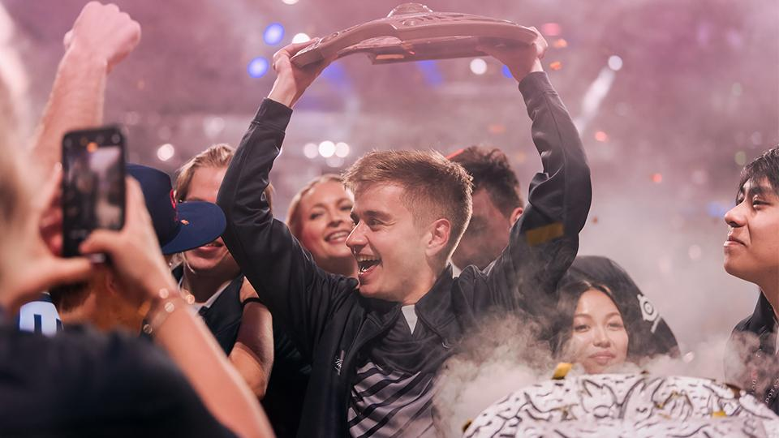
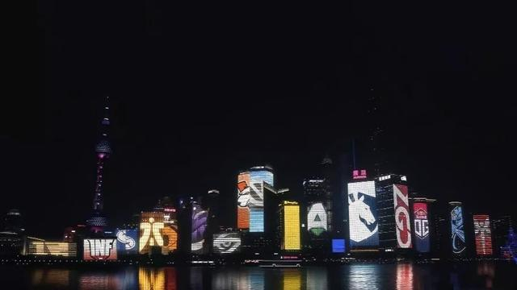
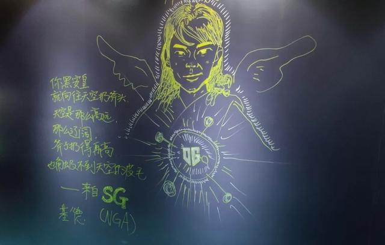

8月25日早，在LGD与李逵开赛前，我在MAX+上发了一篇题为“LGD真能打过李逵和OG吗？”的帖子，对即将上演的败者组决赛和总决赛分享了一些我自己的看法。事实上那时候贴吧里已经有不少不看好LGD的帖子出现了(可能超过半数)，当然也有为LGD鼓气加油助威呐喊的，但是因为我在看了LGD与OG胜者组决赛BO3后，看的出来LGD确实存在一些问题，想要打败李逵或者OG是非常困难的，因此也更加关注那些与我观点类似的贴子。我想看看大神们是如何看待那场BO3的，如何看待目前的LGD“硬实力”，他们输掉胜者组决赛的根本原因是什么

然而结果来的很快，现实让人不愿接受却不得不接受，LGD 1:2 输给了李逵，从第1局的全场碾压李逵，到第2局极有争议的龙芯蝴蝶小狗被秒，再到第3局节奏完全混乱不断被gank，行云流水，现在想起来，就像刚发生过一样。我们那个高中刀友QQ群Team Random(致敬wings)，从本届Ti开始就热闹起来的氛围，突然就像25级的沉默术士放了大，大家都不说话了。我们其实都是怀着不是很看好LGD的心态看比赛的，虽然已经想到了大概率是这个结果，但是当结果真的摆在你面前的时候，仍然是会难受的

最后我还是决定继续看下去，毕竟接下来还有一场Ti7冠军与Ti8冠军的决战，我想看看这两个冲击不朽盾的队伍到底有多强，想看看1穿7的李逵和可能连续两年双冠的OG能给我们带来什么样的对决，他们是如何BP如何理解这款游戏的，同时也想彻底让自己死心，想知道LGD是否真的不配这个冠军。决赛确实没有让我失望，我想应该也没有让大多数或是在现场或是在屏幕前的玩家失望，心服口服，每场比赛节奏都非常紧凑，用FG的话说就是没有一分钟是划的。我们看到了w33的绝活米波、风行，看到了ana的大哥IO，看到了tposen可怕的英雄池以及中期抗局势的强大能力，看到了强队的冷静与韧性，抓住对方一丁点失误，就能绝地翻盘的敏锐，看到了他们对目前版本阵容体系最优解的理解，也看到了CN DOTA与他们的差距，LGD确实配不上决赛的任意一边，配不上这个冠军，今年的CN DOTA不配举起不朽盾

8月25日晚，当ana大哥小精灵一路杀进李逵泉水，李逵被迫打出gg时，宣告了本届Ti9的结束，也无情的宣告了CN DOTA Best DOTA的结束...

## 回顾
回顾今年Ti9全程，短短的两个礼拜，却上演了太多瞬间：采访短片中的LGD和VG互奶，皮鞋说自己是LGD20年老粉；拳酱说自己心态很好，把Ti看的不是很重要；一路高歌猛进的LGD和OG；早早就上了飞机的马桶哥；VP连他们自己也不知道为什么每到Ti就成了软脚虾；号称CN DOTA杀手的TNC，由于kuku辱华事件，导致每当TNC队员入场时，现场观众都嘘嘘，队员Timing在tiwtter上说自己打比赛很难受；VG的水牛体系，打的精彩绝伦，但只拿出来过1次；英勇无比的查理斯总是在LGD发现局势不对的时候被其他4人卖掉，队内地位可见一斑；状态低迷的李逵小组赛差点倒数第一直接淘汰，越打越强，每局都是回家局；中国俱乐部newbee，Ti上的队员都是外国面孔，搞得许多云玩家不知道是什么状况；奇厅长和midone的快乐蓝猫；KG打团就是5个莽夫在乱冲，问他们怎么赢的，不知道，可能是莽赢的吧；海选杀出来的RNG，被xiao8无限看好，其实成绩还不错

本届Ti我所知道的梗
* 虾之国
* 奇桶伪
* 桶，队危，速归；桶，队安，勿念；桶，队威，勿归；桶，队冠，没钱；
* Rtz被迫暴走
* 安斧天高辽，斧高不及毛
* 看OG打EG两小时只为了看握手的那两秒
* LGD画SB
* 身怀六甲
* 谁也虐不了VP的泉

要论最关注的战队，我想应该是LGD、OG、秘密、VG、李逵吧，他们是最有机会冲击冠军的队伍，而其中尤其关注LGD、OG。冥冥之中似有定数，淘汰赛最后两天，LGD和OG的赛程与去年极其相似，都是LGD与OG在胜者组碰面，LGD 1:2 负于OG，Ti8是LGD在败者组击败EG杀上来，再和OG决战。

Ti8赛程

Ti9赛程

而今年是LGD和李逵在败者组对战，如果击败李逵的话，那真是Ti历史上最经典的对决了。败者组决赛前，DG就说有3个剧本：
* Ti7剧本：Ti7冠军李逵1穿8，再拿不朽盾
* Ti8剧本：Ti8冠军OG，达成双冠
* Ti9剧本：LGD力斩Ti7、Ti8冠军，成为Ti9冠军
第3个剧本是最难也是最传奇的剧本，中国的Dotar们多想看到这个剧本啊，再也看不到了

回顾今年一整年Ti前大大小小的赛事，major、minor、梦幻联赛、震中杯、ESL等等，major始于中国重庆，Ti终结于中国上海。在这期间，观众们目睹了秘密和毛子的统治力，中国各个俱乐部的人员调整，CN DOTA的起伏不定，也见证了VG战队的磨合与快速成长，连续两个major冠军给中国Dotar们吃了颗定心丸。也看到了LGD的风格变化，改掉了Ti8的优势瞎逼送，动不动就打肉山被翻，对节奏的掌控能力有所提升。谁也想不到，最后的结局是这样的意料之外，情理之中

回顾整个Ti史，从古老的Navi与A队艺术家，到Ti2的IG、DK四保一、双核、三核体系，再到Ti4的newbee推进体系，Ti6的ban你妈呀wings，最后到Ti8、Ti9的LGD全村希望，CN DOTA走过了一个从加入到超越，从研究发明各种新战术引领全球到如今保守求稳，固步自封，虽然选手实力都是顶尖，但是战略层面早已和国外战队拉开差距的局面。有点像盛极而衰的大唐帝国，太阳慢慢的只剩下余晖

## 观点
决赛结束后的那天晚上，我睡不着觉，刷各种赛后评论，MAX+、微博、知乎，看最后一集刀塔之夜，有人狂喷，有人删游，有人退坑，有人取关，但是其中不乏有很多优秀的观点
* [知乎-连续三年无缘冠军，CN DOTA 出了什么问题？](https://www.zhihu.com/question/342631580)
* [知乎-败者组决赛 LGD 遭 Liquid 让一追二，止步 Ti9 季军，你有什么想说的？](https://www.zhihu.com/question/342631140/answer/801989113)
* [知乎-如何评价Ti9中国战队的表现？](https://www.zhihu.com/question/340644237/answer/789310925)
* [知乎如何评价 OG 战队的两连冠，他们究竟有多强？](https://www.zhihu.com/question/342679647/answer/802339979)
* [微博-ROTK谈西恩刀塔现状：强手太分散，没有银河战舰](https://weibo.com/u/3159721180?is_all=1#1566904767446)
* [微博-Fade退役](https://weibo.com/u/3913570617?is_all=1#1566904885117)

结合自己的所见所闻，以及别人的各种观点，总结了一下，CN DOTA走到今天的局面，主要有以下问题
* 国内DOTA圈子的不职业化，从选手、教练、俱乐部运营、转会交易、青训、组织比赛等等，都很不职业化
* 腌臜内幕，吃外围，打假赛，人情DOTA，资本
* 人口红利流失，移动端的崛起和PC时代的落寞，上手难度高，新人不友好，俱乐部人员流动封闭，新人难有上升渠道
* 环境恶劣，LOL、自走棋歧视，严重的优越感，恶劣的天梯环境，唯胜主义
* 游戏理解和观念落后，仍然停留在对线、打团、操作、farm上，而没有在战略战术、游戏机制、版本体系上下功夫研究
* 有将才无帅才
* 从业人员素质较低，各大战队教练普遍是从捡烟头时代过来的，只凭一点古老的辉煌战绩执掌现代DOTA，多是初高中学历，早该退休了
  
## 思考
我在思考一个问题，DOTA这个游戏对于我来说，到底意味着什么？

从远古的DOTA1时代，我就接触了它，高中无疑是DOTA的黄金时代，也是我的DOTA黄金时代，无论是周五下午跟那群老B们跑去网吧十几人围观两人solo，还是假期包夜的网吧五连坐从来没赢过，这些时光无疑给我带来了无比的欢乐，我收获了友情

大学时代，LOL盛行，全班全系几乎没有人在打DOTA，有些时候，我感觉自己被孤立了，可是我从来没有放弃它，虽然自己玩的少了，但是我更加关注比赛，关注那些还活跃在赛场上的他们；我更多的把时间和精力放在专业上，我收获了孤独和不放弃

如今我已奔3，成了一个一年到头都玩不了几次的云玩家，但是我关注了YC的刀塔节奏，关注了YYF的公众号，下载安装了MAX+，看OpenDota；每次更新，我都会看英雄、物品、游戏机制的改动，每出一个新英雄或至宝，我都会尝试一下；由于有自己的收入，我买了一些喜欢的饰品；我关注每一个major比赛，关注喜欢的战队、选手的近况，不错过每一个刀圈的瓜。我只是，不想离开它，不想和曾经的青春说再见

看到决赛上大爹手上厚厚一摞纸，看到各种评论分析里说的游戏数据分析，又听说OG与OpenAI似乎有秘密训练。我想，我是不是能为CN DOTA做点什么呢？我对机器学习感兴趣并在自学中，我热爱DOTA，我想对5年或10年后的自己说：

如果你在机器学习、数据挖掘领域练就了一些本领，考虑一下DOTA数据分析师吧，帮助CN DOTA重回辉煌

## 附
* [Ti9战队出场合集](https://www.bilibili.com/video/av64735868)

<iframe width=800 height=600 src="//player.bilibili.com/player.html?aid=64735868&cid=112379201&page=1" scrolling="no" border="0" frameborder="no" framespacing="0" allowfullscreen="true"> </iframe>


* [V社纪录片-OG](https://www.bilibili.com/video/av63217399)

<iframe width=800 height=600 src="//player.bilibili.com/player.html?aid=63217399&cid=109955122&page=1" scrolling="no" border="0" frameborder="no" framespacing="0" allowfullscreen="true"> </iframe>


* [V社纪录片-ANA](https://www.bilibili.com/video/av13190224)

<iframe width=800 height=600 src="//player.bilibili.com/player.html?aid=13190224&cid=21631438&page=1" scrolling="no" border="0" frameborder="no" framespacing="0" allowfullscreen="true"> </iframe>


* [真视界-TI8决赛纪录片](https://www.bilibili.com/video/av40848652?from=search&seid=14015347028407073729)

<iframe width=800 height=600 src="//player.bilibili.com/player.html?aid=40848652&cid=71747908&page=1" scrolling="no" border="0" frameborder="no" framespacing="0" allowfullscreen="true"> </iframe>


* [真视界-TI7决赛纪录片](https://www.bilibili.com/video/av14848216?from=search&seid=12271260459333372694)

<iframe width=800 height=600 src="//player.bilibili.com/player.html?aid=14848216&cid=24192646&page=1" scrolling="no" border="0" frameborder="no" framespacing="0" allowfullscreen="true"> </iframe>


* [追梦人-TI6 wings夺冠纪录片](https://www.bilibili.com/video/av52704238?from=search&seid=15049770013698761140)

<iframe width=800 height=600 src="//player.bilibili.com/player.html?aid=52704238&cid=92228301&page=29" scrolling="no" border="0" frameborder="no" framespacing="0" allowfullscreen="true"> </iframe>


* [TI9战队介绍bgm]

<iframe frameborder="no" border="0" marginwidth="0" marginheight="0" width=330 height=86 src="//music.163.com/outchain/player?type=3&id=2062759594&auto=1&height=66"></iframe>


* [TI6 wings夺冠纪录片bgm]

<iframe frameborder="no" border="0" marginwidth="0" marginheight="0" width=330 height=86 src="//music.163.com/outchain/player?type=2&id=27867802&auto=1&height=66"></iframe>
