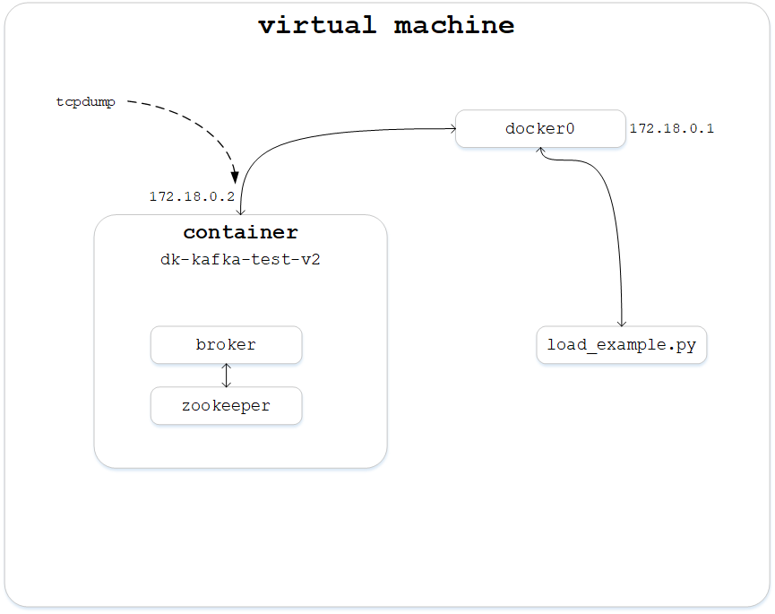
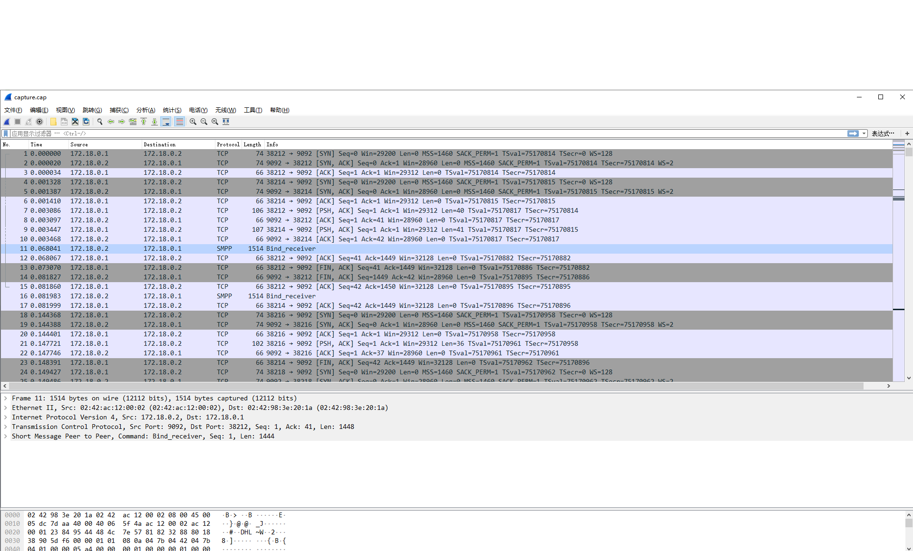
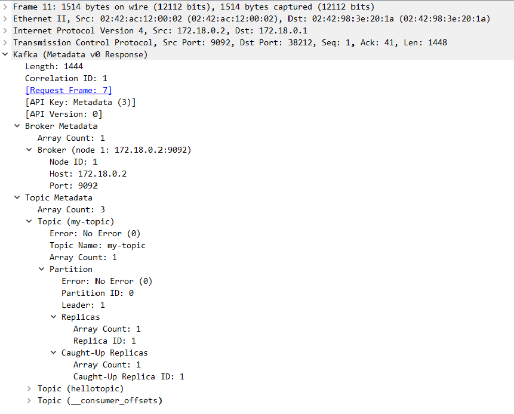
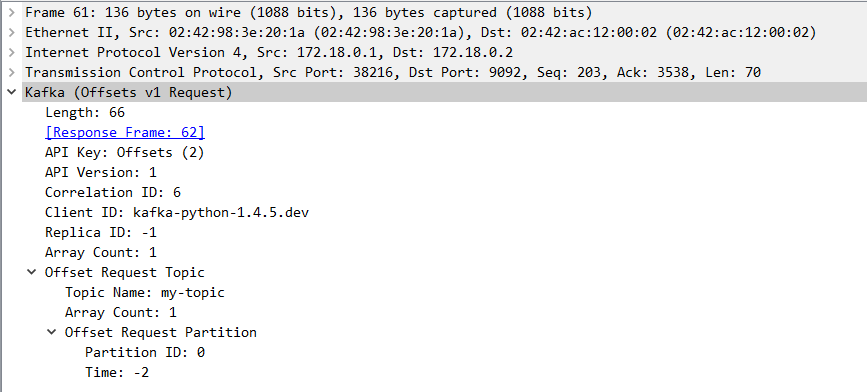
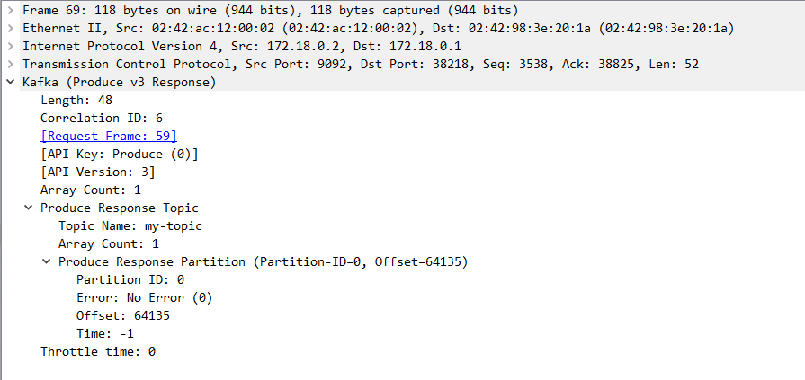

看源码看了一段时间了，发现很多协议上有些概念和流程理解的不到位，因此搭建环境来抓包分析一下整个消息交互的过程是怎么样的

## 环境介绍
kafka的broker(只有一个)服务运行于虚拟机上的docker容器(dk-kafka-test-v2)中，虚拟机和容器都是centos7系统，宿主和容器之间网络模式为Bridge模式。环境示意图如下

容器连接到宿主的docker0桥上，宿主地址172.18.0.1，容器地址172.18.0.2，在容器中使用tcpdump抓包

### 注意
#### 环境安装问题
需要安装以下内容
* jdk
* zookeeper
* kafka

#### docker的hostname问题
在docker中运行kafka服务后，宿主运行load_example.py，会报`DNS lookup failed`错误，因为docker的hostname默认是一串数字，调用`socket.getaddrinfo()`函数解析不了该hostname，需手动修改/etc/hosts
```
127.0.0.1       localhost
::1     localhost ip6-localhost ip6-loopback
fe00::0 ip6-localnet
ff00::0 ip6-mcastprefix
ff02::1 ip6-allnodes
ff02::2 ip6-allrouters
172.17.0.2      172.17.0.2
172.18.0.2      172.18.0.2
```

## 具体操作
### broker启动
容器中已经编写好shell脚本启动zookeeper和broker
```sh
kafka_path='kafka_broker'
zookeeper_path='zookeeper'

source /etc/profile

./$zookeeper_path/bin/zkServer.sh start

./$kafka_path/bin/kafka-server-start.sh $kafka_path/config/server.properties
```
执行脚本，broker启动运行
```
[root@3b86889153b0 local]# ./kafka_broker_start.sh   
ZooKeeper JMX enabled by default
Using config: /usr/local/zookeeper/bin/../conf/zoo.cfg
Starting zookeeper ... already running as process 84.
[2019-05-07 12:33:13,714] INFO Registered kafka:type=kafka.Log4jController MBean (kafka.utils.Log4jControllerRegistration$)
[2019-05-07 12:33:14,630] INFO starting (kafka.server.KafkaServer)
[2019-05-07 12:33:14,632] INFO Connecting to zookeeper on localhost:2181 (kafka.server.KafkaServer)
[2019-05-07 12:33:14,676] INFO [ZooKeeperClient] Initializing a new session to localhost:2181. (kafka.zookeeper.ZooKeeperClient)
[2019-05-07 12:33:14,683] INFO Client environment:zookeeper.version=3.4.13-2d71af4dbe22557fda74f9a9b4309b15a7487f03, built on 06/29/2018 00:39 GMT (org.apache.zookeeper.ZooKeeper)
[2019-05-07 12:33:14,684] INFO Client environment:host.name=3b86889153b0 (org.apache.zookeeper.ZooKeeper)
[2019-05-07 12:33:14,684] INFO Client environment:java.version=12.0.1 (org.apache.zookeeper.ZooKeeper)
[2019-05-07 12:33:14,684] INFO Client environment:java.vendor=Oracle Corporation (org.apache.zookeeper.ZooKeeper)
[2019-05-07 12:33:14,684] INFO Client environment:java.home=/usr/local/java (org.apache.zookeeper.ZooKeeper)
...
```

### 启动抓包
抓包使用tcpdump工具，执行以下命令，指定截获eth1接口的端口号为9092的tcp包，保存到capture.cap文件
```sh
tcpdump -i eth1 tcp port 9092 -w capture.cap
```

### 宿主运行load_example.py
宿主上运行python-kafka的load_example.py测试脚本，该脚本会启动一个生产者和一个消费者，生产者循环生产数据，消费者循环消费数据，需要先修改生产者和消费者配置的broker地址
```python
class Producer(threading.Thread):
    big_msg = b'1' * msg_size

    def run(self):
        producer = KafkaProducer(bootstrap_servers='172.18.0.2:9092')
        self.sent = 0

        while not producer_stop.is_set():
            producer.send('my-topic', self.big_msg)
            self.sent += 1
        producer.flush()
......
class Consumer(threading.Thread):

    def run(self):
        consumer = KafkaConsumer(bootstrap_servers='172.18.0.2:9092',
                                 auto_offset_reset='earliest')
        consumer.subscribe(['my-topic'])
        self.valid = 0
        self.invalid = 0

        for message in consumer:
            if len(message.value) == msg_size:
                self.valid += 1
            else:
                self.invalid += 1
```

执行脚本后，开始数据传输，打开了日志的DEBUG模式
```
[root@localhost kafka-python]# python benchmarks/load_example.py                        
2019-05-07 22:34:07,437.437.673091888:kafka.producer.kafka:139872394159872:DEBUG:32192:Starting the Kafka producer
2019-05-07 22:34:07,438.438.35401535:kafka.metrics.metrics:139872394159872:DEBUG:32192:Added sensor with name connections-closed
2019-05-07 22:34:07,438.438.606977463:kafka.metrics.metrics:139872394159872:DEBUG:32192:Added sensor with name connections-created
2019-05-07 22:34:07,438.438.797950745:kafka.metrics.metrics:139872394159872:DEBUG:32192:Added sensor with name select-time
2019-05-07 22:34:07,439.439.13602829:kafka.metrics.metrics:139872394159872:DEBUG:32192:Added sensor with name io-time
2019-05-07 22:34:07,439.439.702033997:kafka.metrics.metrics:139872385505024:DEBUG:32192:Added sensor with name connections-closed
2019-05-07 22:34:07,440.440.099954605:kafka.client:139872394159872:INFO:32192:Bootstrapping cluster metadata from [('172.18.0.2', 9092, 2)]
2019-05-07 22:34:07,440.440.378904343:kafka.metrics.metrics:139872385505024:DEBUG:32192:Added sensor with name connections-created
2019-05-07 22:34:07,440.440.948963165:kafka.metrics.metrics:139872385505024:DEBUG:32192:Added sensor with name select-time
2019-05-07 22:34:07,440.440.732955933:kafka.client:139872394159872:DEBUG:32192:Attempting to bootstrap via node at 172.18.0.2:9092
2019-05-07 22:34:07,441.441.575050354:kafka.metrics.metrics:139872394159872:DEBUG:32192:Added sensor with name bytes-sent-received
2019-05-07 22:34:07,441.441.804885864:kafka.metrics.metrics:139872394159872:DEBUG:32192:Added sensor with name bytes-sent
2019-05-07 22:34:07,442.442.168951035:kafka.metrics.metrics:139872394159872:DEBUG:32192:Added sensor with name bytes-received
2019-05-07 22:34:07,442.442.622900009:kafka.metrics.metrics:139872385505024:DEBUG:32192:Added sensor with name io-time
2019-05-07 22:34:07,443.443.308115005:kafka.client:139872385505024:INFO:32192:Bootstrapping cluster metadata from [('172.18.0.2', 9092, 2)]
2019-05-07 22:34:07,443.443.564891815:kafka.client:139872385505024:DEBUG:32192:Attempting to bootstrap via node at 172.18.0.2:9092
2019-05-07 22:34:07,444.444.015979767:kafka.metrics.metrics:139872385505024:DEBUG:32192:Added sensor with name bytes-sent-received
2019-05-07 22:34:07,444.444.26202774:kafka.metrics.metrics:139872385505024:DEBUG:32192:Added sensor with name bytes-sent
......
```

### wireshark打开抓包文件
宿主上执行以下命令，将容器中的抓包文件拷贝到共享文件夹下
```
docker cp dk-kafka-v2:/usr/local/capture.cap /home/share/
```
wireshark(3.0.0)打开该文件，内容如下

会发现其中有很多SMPP类型的报文，这其实就是kafka协议报文，wireshark是支持kafka协议的(版本过低可能解析不了，因为kafka协议也是最新的)

选中一包SMPP数据，右击选择解码为


在弹出的对话框中将当前值选择为kafka


确认后，显示的协议类型就是kafka了


## 报文分析
* 抓包文件 [capture.cap](python-kafka抓包分析/download/capture.cap)
* load_example.py运行日志 [load_example.log](python-kafka抓包分析/download/load_example.log)

### 建立连接
可看到前6个报文分别是生产者和消费者与broker的tcp三次握手，生产者源端口号为38212，消费者源端口号为38214

### metadata请求
连接建立之后，生产者和消费者都向broker发起了metadata请求，报文结构如下图

该请求中API Key为3，还包含了API Version、Correlation ID等字段

那么什么是metadata呢？由于kafka的broker是分布式集群，metadata记录了一些和集群有关的映射信息
* broker.id与node的对应关系
* topic与partition的对应关系
* node与partition的对应关系

详细的metadata解释见[Kafka 源码之生产者 Metadata 更新机制（二）](https://www.jianshu.com/p/bb7c332eac25)

broker接收到该请求后，首先会回一个ack，然后回复一个metadata响应，报文结构如图


返回的结构中，主要包含两大块信息：Broker Metadata和Topic Metadata。Broker Metadata中只有一个Broker，包含该broker的Node ID、Host和Port，因为本环境中只有一个broker，就是在容器中的broker。Topic Metadata共有3个，分别是my-topic、hellotopic和__consumer_offsets，因为load_example.py脚本创建的topic是my-topic，另外两个是做测试时创建的

每隔topic结构中包含该topic的名字和一个partition，什么是partition呢？一个topic可以有多个partition，消息会被发送到不同的partition，每个partition其实就是broker下的一个log文件，存放消息。多个partition会有一个leader，负责备份和写入，Replicas就是备份信息

### ApiVersion请求
猜测可能各个版本的api有些差异，因此要对齐api版本

请求报文结构如图，key为18


响应报文结构如图

broker回返回自己支持的各部分api版本，包括Produce、Fetch、Offsets、Metadata、LeaderAndIsr、StopReplica等等

### Offset请求
消费者会先请求一次Offset，Offset记录了broker当前消费位置信息

请求报文结构如图，key为2

该报文中包含了要请求的topic和partition

响应报文结构如图

可以看出my-topic的partition1的offset为12705

### Produce请求
Porduce请求是生产者向broker发送的生产数据请求

请求报文如图，key为0

其中Message Set Size字段告知了数据大小为15556，Message Set->Message是消息实体，包含了CRC校验头、Magic Byte等内容

响应报文如图

返回的报文中包含一个offset

### Fetch请求
Fetch请求是消费者向broker发出的请求，向broker申请消费数据

请求报文结构如图，key为1

其中告知了请求的topic、partition、offset和最大字节数Max bytes

响应报文如图

响应报文不是kafka协议报文，而是直接tcp流，将数据发过来

总结消息交过流程如图

