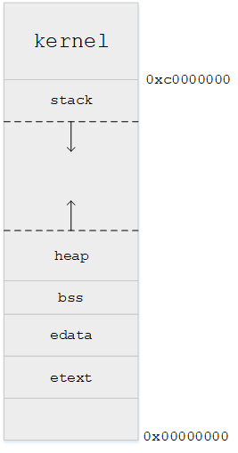
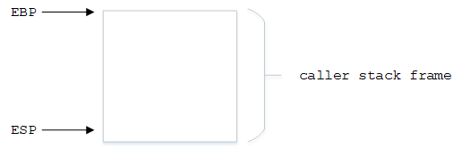
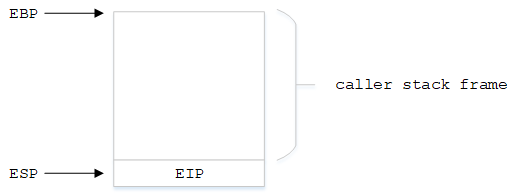
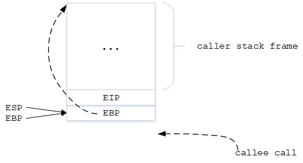
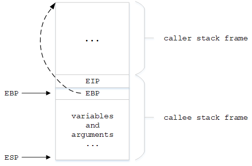
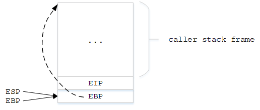
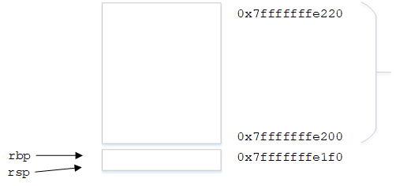

函数是许多编程语言的代码基本单元，多层函数的嵌套调用在系统层面是依赖栈机制来实现的，此处的栈指的不是软件编程数据结构中的堆和栈，而是由不同体系架构的处理器提供的程序指针寄存器、栈基址寄存器、堆栈寄存器等结构以及操作系统辅助构成的函数运行环境。理解函数调用栈对理解程序在内存中的运行以及理解操作系统进程管理都是很有帮助的。本文尝试回答以下问题

* 什么是函数栈
* 函数栈为什么能保存上级函数的信息
* Linux中如何管理函数栈
* 函数栈有多大，会溢出吗，溢出了怎么办。平时调试代码时程序崩溃后打印的堆栈信息是什么意思

## 基础知识

在理解函数调用栈之前，需要提前了解一些背景知识，包括计算机中一条指令是如何运行的、CPU对栈的支持、Linux进程虚拟内存空间、栈帧结构

### X86 CPU寄存器

函数调用栈从根本上来说，是由CPU堆栈相关寄存器实现的。不同体系结构对于程序指令运行的处理有很大不同，本文以X86架构CPU为例，分析其函数调用过程。与堆栈有关的寄存器主要是如下几个

| 寄存器                        | 作用            |
| -------------------------- | ------------- |
| EIP\(instruction pointer\) | 指令寄存器，64位为RIP |
| ESP\(stack pointer\)       | 堆栈寄存器，64位为RSP |
| EBP\(base pointer\)        | 基址寄存器，64位为RBP |

`EIP`是指令寄存器，它存放的是下一条指令的地址。如果没有函数堆栈结构，计算机的指令执行过程完全依赖于`EIP`寄存器，CPU每次从`EIP`寄存器获取一条指令，`EIP`会自动累加，从而实现了CPU的顺序执行，如图


ESP是堆栈寄存器，它永远指向系统最上面一个栈帧的栈顶，EBP是基址寄存器，永远指向系统最上面一个栈帧的栈底。那什么是栈帧呢？它是什么结构的呢？在内存中位于什么位置呢？后文详细介绍

### 进程虚拟内存空间和栈

讨论函数的执行，我们需要了解函数的执行环境是怎样的。这里我们讨论范围仅限于Linux系统下的用户空间进程中的函数执行。在Linux系统中，将整个内存空间按照3:1的比例划分为了用户空间和内核空间两大区域，默认系统配置情况下，0~3G为用户空间，3~4G为内核空间。我们创建的程序代码，都是以进程的方式运行于用户空间的虚拟内存中，当某个进程被调度时，其整个内存分布图如图所示


用户空间从0x00000000到0xc0000000，其中包括很多内容，包括栈(stack)、堆(heap)、静态变量(bss)、数据段(edata)、代码段(etext)等。当一个程序被加载到内存空间执行时，这些内容除了堆是由用户来分配，其他都是由操作系统来分配和管理。本文所关心的栈结构，其大小是固定的，Linux中一般是8M(可配置)，通过命令`ulimit -s`可查看当前栈空间大小

```shell
[root@localhost home]# ulimit -s
8192
```

当程序运行函数嵌套过多时，当然会超过这个限定大小，这会触发缺页异常，操作系统会计算并增长栈空间

## 栈和栈帧(Stack Frame)

栈是从上往下生长，先占用高地址，再占用低地址，主要有3个作用

* 为函数内部声明的非静态局部变量(C语言中称自动变量)提供存储空间
* 记录函数调用过程相关的维护性信息，称为栈帧(Stack Frame)或过程活动记录(Procedure Activation Record)。它包括函数返回地址，不适合装入寄存器的函数参数及一些寄存器值的保存。除递归调用外，堆栈并非必需。因为编译时可获知局部变量，参数和返回地址所需空间，并将其分配于BSS段
* 临时存储区，用于暂存长算术表达式部分计算结果或alloc()函数分配的栈内内存

程序的运行是依靠`EIP`指针的累加从而一条指令一条指令执行的，但是当函数调用时，在跳转到子函数时和子函数返回时，显然地址不是连续的，如何做到外层函数的保存和返回呢？在同一个时刻，堆栈中会有多个函数的信息，每个待返回的函数都会占用一块独立的连续区域，这个区域就是栈帧。一个栈帧中主要存放以下关键信息

* 上一栈帧的栈顶地址
* 局部变量
* 参数列表

整个栈结构如图所示


同一时间会存在多个栈帧，最下面的栈帧代表着当前函数，越上层的栈帧代表越外层的函数


## 函数调用过程

函数调用过程主要有3个阶段

* 调用目标函数之前的准备工作
* 调用目标函数
* 目标函数返回到调用目标函数

为了方便说明，指定调用目标函数的函数为`caller`，目标函数为`callee`。在调用`callee`之前，`caller`的栈帧已经存在于内存中，如图所示



此时`EBP`指向`caller`栈帧的栈底，`ESP`指向`caller`栈帧的栈顶

### 准备工作

在调用`callee`之前，`caller`会将`EIP`的值压栈保存，然后修改`EIP`寄存器的值指向被调用者`callee`，如图



### 调用

调用`callee`需要完成两个操作

```c
pushl %ebp  
movel %esp, %ebp    
```

第一条指令是将`EBP`的值压栈


第二条指令是移动`EBP`到栈顶


### 返回

`callee`返回前，其栈帧结构如图


栈帧中已经存在一些局部变量和参数

`callee`返回要完成两个操作

```c
movel %ebp, %esp
popl %ebp
```

第一条指令将`callee`的栈帧清空


第二条指令将`EBP`恢复到之前压栈的地址，也就是`caller`的栈帧基地址


由于调用`callee`前将`caller`下一条指令地址`EIP`已经压栈保存，此时只需要将`EIP`再设置为该保存值就可以恢复`caller`的执行

## 实例

以下使用C代码实例，运行于centos7 64bit linux-3.10 环境，通过反汇编代码和gdb调试来分析函数调用栈的过程。C代码test.c如下

```c
int sum(a, b)
{
    return (a+b);
}

int main(int argc, char *argv[])
{
    int a, b, c;

    a = 2;
    b = 3;

    c = sum(a, b);

    return 0;
}
```

将test.c编译生成可执行文件，再用objdump命令反汇编

```bash
gcc -c test.c -o test
objdump -s -d test > test.stxt
```

汇编代码内容如下

```c
test:     file format elf64-x86-64

Contents of section .text:
 0000 554889e5 897dfc89 75f88b45 f88b55fc  UH...}..u..E..U.
 0010 01d05dc3 554889e5 4883ec20 897dec48  ..].UH..H.. .}.H
 0020 8975e0c7 45fc0200 0000c745 f8030000  .u..E......E....
 0030 008b55f8 8b45fc89 d689c7e8 00000000  ..U..E..........
 0040 8945f4b8 00000000 c9c3               .E........      
Contents of section .comment:
 0000 00474343 3a202847 4e552920 342e382e  .GCC: (GNU) 4.8.
 0010 35203230 31353036 32332028 52656420  5 20150623 (Red 
 0020 48617420 342e382e 352d3131 2900      Hat 4.8.5-11).  
Contents of section .eh_frame:
 0000 14000000 00000000 017a5200 01781001  .........zR..x..
 0010 1b0c0708 90010000 1c000000 1c000000  ................
 0020 00000000 14000000 00410e10 8602430d  .........A....C.
 0030 064f0c07 08000000 1c000000 3c000000  .O..........<...
 0040 00000000 36000000 00410e10 8602430d  ....6....A....C.
 0050 06710c07 08000000                    .q......        

Disassembly of section .text:

0000000000000000 <sum>:
   0:    55                       push   %rbp
   1:    48 89 e5                 mov    %rsp,%rbp
   4:    89 7d fc                 mov    %edi,-0x4(%rbp)
   7:    89 75 f8                 mov    %esi,-0x8(%rbp)
   a:    8b 45 f8                 mov    -0x8(%rbp),%eax
   d:    8b 55 fc                 mov    -0x4(%rbp),%edx
  10:    01 d0                    add    %edx,%eax
  12:    5d                       pop    %rbp
  13:    c3                       retq   

0000000000000014 <main>:
  14:    55                       push   %rbp
  15:    48 89 e5                 mov    %rsp,%rbp
  18:    48 83 ec 20              sub    $0x20,%rsp
  1c:    89 7d ec                 mov    %edi,-0x14(%rbp)
  1f:    48 89 75 e0              mov    %rsi,-0x20(%rbp)
  23:    c7 45 fc 02 00 00 00     movl   $0x2,-0x4(%rbp)
  2a:    c7 45 f8 03 00 00 00     movl   $0x3,-0x8(%rbp)
  31:    8b 55 f8                 mov    -0x8(%rbp),%edx
  34:    8b 45 fc                 mov    -0x4(%rbp),%eax
  37:    89 d6                    mov    %edx,%esi
  39:    89 c7                    mov    %eax,%edi
  3b:    e8 00 00 00 00           callq  40 <main+0x2c>
  40:    89 45 f4                 mov    %eax,-0xc(%rbp)
  43:    b8 00 00 00 00           mov    $0x0,%eax
  48:    c9                       leaveq 
  49:    c3                       retq
```

第14、15条指令，`main`函数首先是准备自己的栈空间。`call`命令本身会保存`RIP`寄存器的值。在`sum`函数开头，会将`RBP`压栈，保存`main`函数的栈帧基址，然后将`RBP`移动到栈顶。在`sum`函数返回时，会将`RBP`出栈

### gdb调试

使用gdb调试C代码， 在编译时需要加上`-g`参数

```bash
gcc -o test -g test.c
```

执行以下命令以gdb调试可执行程序

```bash
gdb test
```

gdb调试打印如下

```bash
GNU gdb (GDB) Red Hat Enterprise Linux 7.6.1-94.el7
Copyright (C) 2013 Free Software Foundation, Inc.
License GPLv3+: GNU GPL version 3 or later <http://gnu.org/licenses/gpl.html>
This is free software: you are free to change and redistribute it.
There is NO WARRANTY, to the extent permitted by law.  Type "show copying"
and "show warranty" for details.
This GDB was configured as "x86_64-redhat-linux-gnu".
For bug reporting instructions, please see:
<http://www.gnu.org/software/gdb/bugs/>...
Reading symbols from /home/share/test/c/elf_test/test...done.
(gdb) 
```

gdb下调试函数栈帧，可用以下命令

* backktrace：显示程序的调用栈信息，缩写'bt'
* frame: 查看栈帧信息
* info frame：查看栈帧详细信息

首先在main函数处设置断点，并查看函数栈信息

```bash
(gdb) b main
Breakpoint 1 at 0x400510: file test.c, line 13.
(gdb) run
Starting program: /home/share/test/c/elf_test/test 

Breakpoint 1, main (argc=1, argv=0x7fffffffe308) at test.c:13
13        a = 2;
(gdb) bt
#0  main (argc=1, argv=0x7fffffffe308) at test.c:13
(gdb) 
```

可看到当前程序存在一个栈帧，栈帧号为0，是main函数

查看详细栈帧信息

```bash
(gdb) info frame
Stack level 0, frame at 0x7fffffffe230:
 rip = 0x400510 in main (test.c:13); saved rip 0x7ffff7a3db35
 source language c.
 Arglist at 0x7fffffffe220, args: argc=1, argv=0x7fffffffe308
 Locals at 0x7fffffffe220, Previous frame's sp is 0x7fffffffe230
 Saved registers:
  rbp at 0x7fffffffe220, rip at 0x7fffffffe228
(gdb) 
```

使用`info reg`查看寄存器信息

```bash
(gdb) info reg
rax            0x400501    4195585
rbx            0x0    0
rcx            0x400540    4195648
rdx            0x7fffffffe318    140737488347928
rsi            0x7fffffffe308    140737488347912
rdi            0x1    1
rbp            0x7fffffffe220    0x7fffffffe220
rsp            0x7fffffffe200    0x7fffffffe200
r8             0x7ffff7dd7e80    140737351876224
r9             0x0    0
r10            0x7fffffffe070    140737488347248
r11            0x7ffff7a3da40    140737348098624
r12            0x400400    4195328
r13            0x7fffffffe300    140737488347904
r14            0x0    0
r15            0x0    0
rip            0x400510    0x400510 <main+15>
eflags         0x206    [ PF IF ]
cs             0x33    51
ss             0x2b    43
ds             0x0    0
es             0x0    0
fs             0x0    0
gs             0x0    0
```

栈基址`rbp`为`0x7fffffffe220`，栈顶地址`rsp`为`0x7fffffffe200`，如图


`s`单步调试，直到程序进入`sum`函数，查看栈结构

```bash
(gdb) s
14        b = 3;
(gdb) s
17        c = sum(a, b);
(gdb) bt
#0  main (argc=1, argv=0x7fffffffe308) at test.c:17
(gdb) s
sum (a=2, b=3) at test.c:6
6        return (a+b);
(gdb) bt
#0  sum (a=2, b=3) at test.c:6
#1  0x000000000040052d in main (argc=1, argv=0x7fffffffe308) at test.c:17
(gdb) 
```

可看到此时有两个栈帧0和1，`main`函数栈帧号变成了1，`sum`函数栈帧号是0。用`info frame`命令分别查看两个栈帧信息

```bash
(gdb) info frame 0
Stack frame at 0x7fffffffe200:
 rip = 0x4004f7 in sum (test.c:6); saved rip 0x40052d
 called by frame at 0x7fffffffe230
 source language c.
 Arglist at 0x7fffffffe1f0, args: a=2, b=3
 Locals at 0x7fffffffe1f0, Previous frame's sp is 0x7fffffffe200
 Saved registers:
  rbp at 0x7fffffffe1f0, rip at 0x7fffffffe1f8
(gdb) info frame 1
Stack frame at 0x7fffffffe230:
 rip = 0x40052d in main (test.c:17); saved rip 0x7ffff7a3db35
 caller of frame at 0x7fffffffe200
 source language c.
 Arglist at 0x7fffffffe220, args: argc=1, argv=0x7fffffffe308
 Locals at 0x7fffffffe220, Previous frame's sp is 0x7fffffffe230
 Saved registers:
  rbp at 0x7fffffffe220, rip at 0x7fffffffe228
(gdb) 
```

查看寄存器值

```bash
(gdb) info reg
rax            0x2    2
rbx            0x0    0
rcx            0x400540    4195648
rdx            0x3    3
rsi            0x3    3
rdi            0x2    2
rbp            0x7fffffffe1f0    0x7fffffffe1f0
rsp            0x7fffffffe1f0    0x7fffffffe1f0
r8             0x7ffff7dd7e80    140737351876224
r9             0x0    0
r10            0x7fffffffe070    140737488347248
r11            0x7ffff7a3da40    140737348098624
r12            0x400400    4195328
r13            0x7fffffffe300    140737488347904
r14            0x0    0
r15            0x0    0
rip            0x4004f7    0x4004f7 <sum+10>
eflags         0x206    [ PF IF ]
cs             0x33    51
ss             0x2b    43
ds             0x0    0
es             0x0    0
fs             0x0    0
gs             0x0    0
```

可看到函数`sum`的栈顶栈底都是`0x7fffffffe1f0`，因为该函数函数体只有一个返回语句，此时函数栈结构为


## 参考

* [CSDN-Xzzzh-Linux虚拟地址空间布局以及进程栈和线程栈总结](https://www.cnblogs.com/xzzzh/p/6596982.html)
* [CSDN-gdb查看函数调用栈](https://blog.csdn.net/baidu_24256693/article/details/47297209)
