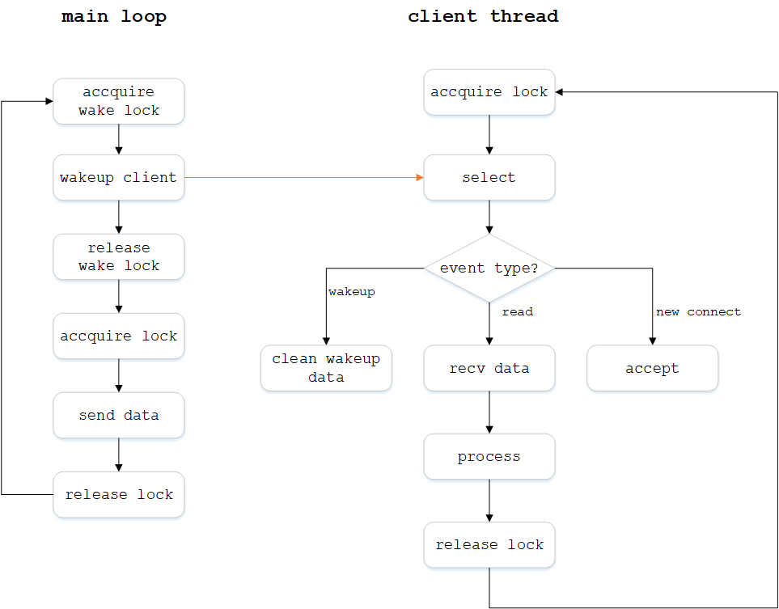

在分析`kafka-python`源码时发现生产者经常调用其子对象`Client`的一个`wakeup()`方法，它利用了socketpair管道发送一个数据来快速唤醒selector，快速中断selector的轮询。上下文关系如图所示

程序运行中有两个线程，主线程'main loop'和客户端线程'client thread'。主线程定时利用client发送数据到server，而client线程本身要调用`selector()`函数以超时等待的方式轮询server的数据。当主线程要发送数据时，先调用一个`wakeup()`函数唤醒client，然后发送

wakeup函数代码如下
```python
def wakeup(self):
    with self._wake_lock:
        try:
            self._wake_w.sendall(b'x')
        except socket.timeout:
            log.warning('Timeout to send to wakeup socket!')
            raise Errors.KafkaTimeoutError()
        except socket.error:
            log.warning('Unable to send to wakeup socket!')
```
其中`_wake_lock`是通过`threading.Lock()`创建的线程锁，`_wake_w`是由`socket.socketpair()`函数创建的socket管道写端

我猜测这样的用法是因为直接调用`send()`函数发送数据最终会调用`client.send()`，这里会请求lock，但是如果selector的轮训线程在等待超时之前已经申请了lock，导致send阻塞，无法发送数据，直到selector超时结束并释放了lock之后，send才能发送。wakeup的作用是让selector收到数据，并立刻释放lock，使得send可以立即申请到lock并发送数据

## 验证
编写的测试脚本如下
```python
import time
import socket
import threading
try:
    import selectors  # Python2.7不支持selectors模块，找的源码
except ImportError:
    from vendor import selectors34 as selectors

class Poller(threading.Thread):
    def __init__(self):
        super(Poller, self).__init__()
        self._selector = selectors.DefaultSelector()    
        self._wake_r, self._wake_w = socket.socketpair()    # 利用socketpair创建唤醒消息通道
        self._wake_r.setblocking(False)
        self._wake_w.settimeout(3)
        self._wake_lock = threading.Lock()
        self._lock = threading.RLock()
        self._selector.register(self._wake_r, selectors.EVENT_READ)
        self.stop_event = threading.Event()     # 线程结束控制信号

    def stop(self):     # 控制线程结束方法
        with self._lock:
            self.stop_event.set()

    def _clear_wake_fd(self):   # 清理唤醒通道的数据
        while True:
            try:
                self._wake_r.recv(1024)
            except socket.error:
                break

    def close(self):
        self._wake_r.close()
        self._wake_w.close()
        self._selector.close()

    def wakeup(self):   # 唤醒方法
        with self._wake_lock:
            try:
                self._wake_w.sendall(b'x')
            except socket.timeout:
                print 'Timeout to send to wakeup socket!'
            except socket.error:
                print 'Unable to send to wakeup socket!'    

    def run(self):  
        while not self.stop_event.is_set():
            try:
                self.poll()
            except Exception as e:
                print 'Exception {}'.format(e)
                self.stop()
        try:
            self.close()
        except Exception as e:
            print e

    def poll(self):
        with self._lock:
            print 'selecting...'
            start_select = time.time()
            ready = self._selector.select(10)
            end_select = time.time()
            print 'select time {}'.format(end_select-start_select)

            for key, events in ready:
                if key.fileobj is self._wake_r:
                    print 'is wakeup event'
                    self._clear_wake_fd()
                    continue
                elif not (events & selectors.EVENT_READ):
                    continue
                try:
                    data = key.fileobj.recv(1024)
                    print data
                except Exception as e:
                    print e    


if __name__ == "__main__":
    p = Poller()
    p.start()

    time.sleep(60)      # 注释这里以启用唤醒测试

    # 注释这里以关闭唤醒测试
    '''
    count = 0           
    while count < 5:
        time.sleep(3)
        p.wakeup()
        count += 1
    '''
    p.stop()
```

主循环定时每3秒调用`wakeup`方法唤醒线程selector，线程中`select()`函数结束后打印等待时间

## 测试结果
### 不启用唤醒
主函数代码为
```python
if __name__ == "__main__":
    p = Poller()
    p.start()

    time.sleep(60)      # 注释这里以启用唤醒测试
    p.stop()
```
运行程序，结果为
```shell
>> python selector_sockpair_wakeup.py
selecting...
select time 10.0130000114
selecting...
select time 10.0150001049
selecting...
select time 10.004999876
selecting...
select time 10.0050001144
selecting...
select time 10.004999876
selecting...
select time 10.0090000629
selecting...
select time 10.0120000839
```
程序正常运行，每10秒select发生超时

### 启用唤醒
主函数代码为
```python
if __name__ == "__main__":
    p = Poller()
    p.start()
    count = 0
    while count < 5:
        time.sleep(3)
        p.wakeup()
        count += 1
    p.stop()
```
运行程序，结果为
```shell
>> python selector_sockpair_wakeup.py
selecting...
select time 3.01499986649
is wakeup event
selecting...
select time 3.0150001049
is wakeup event
selecting...
select time 3.0150001049
is wakeup event
selecting...
select time 3.00499987602
is wakeup event
selecting...
select time 3.00200009346
is wakeup event
selecting...
select time 10.003000021
```
由于主循环中调用了`wakeup()`方法，select收到数据，因此select时间是3秒
