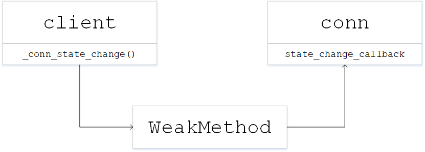
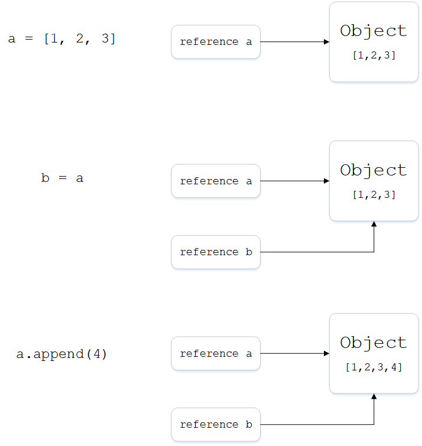

在分析`kafka-python`源码时发现有个回调函数的处理怎么看也看不懂，生产者创建了一个client对象实例，client有一个方法`_conn_state_change()`。当建立连接时，使用conn实例来描述和管理一个连接，conn需要用到client的`_conn_state_change()`方法，因此在创建conn实例时要传入该方法，大致的上下文逻辑如图

代码如下
```python
cb = WeakMethod(self._conn_state_change)
conn = BrokerConnection(host, broker.port, afi,
                        state_change_callback=cb,
                        node_id=node_id,
                        **self.config)
self._conns[node_id] = conn
```
为什么不能直接将该函数作为参数传入，而要通过另外一个类`WeakMethod`来封装一下，将返回的对象传入呢？

`Weakmethod`类的定义如下
```python
class WeakMethod(object):
    """
    Callable that weakly references a method and the object it is bound to. It
    is based on https://stackoverflow.com/a/24287465.

    Arguments:

        object_dot_method: A bound instance method (i.e. 'object.method').
    """
    def __init__(self, object_dot_method):
        try:
            self.target = weakref.ref(object_dot_method.__self__)
        except AttributeError:
            self.target = weakref.ref(object_dot_method.im_self)
        self._target_id = id(self.target())
        try:
            self.method = weakref.ref(object_dot_method.__func__)
        except AttributeError:
            self.method = weakref.ref(object_dot_method.im_func)
        self._method_id = id(self.method())

    def __call__(self, *args, **kwargs):
        """
        Calls the method on target with args and kwargs.
        """
        return self.method()(self.target(), *args, **kwargs)

    def __hash__(self):
        return hash(self.target) ^ hash(self.method)

    def __eq__(self, other):
        if not isinstance(other, WeakMethod):
            return False
        return self._target_id == other._target_id and self._method_id == other._method_id
```

发现`WeakMethod`的定义中使用了`weakref`，通过查阅资料，才了解到这是python的弱引用。又经过一番查资料和写测试代码，才对python中的引用、拷贝和垃圾回收有了一定的理解

## 引用式变量
首先必须明确的一点是，类似Python或者Java语言中，变量只是一个标注，而不是对象本身。以一个例子来证明
```python
>>> a = [1, 2, 3]
>>> b = a
>>> a.append(4)
>>> b
[1, 2, 3, 4]
```
对列表a的改动，结果b也发生了同样的改动，原因是a、b都只是同一个列表的引用，对引用的操作实质上是对对象本身的操作，如下图


## 默认做浅拷贝
这里有一个将代码运行转换成交互式动画的网站[Python Tutor](http://www.pythontutor.com)可以方便查看代码运行过程中到底发生了什么

Python默认的拷贝方式是浅拷贝，即只复制最外层容器，以下例子用来说明
```python
>>> l1 = [3, [55, 44], (7, 8, 9)]
>>> l2 = list(l1)
>>> l2
[3, [55, 44], (7, 8, 9)]
>>> l1.append(100)
>>> l1[1].remove(55)    
>>> print('l1:', l1)
('l1:', [3, [44], (7, 8, 9), 100])
>>> print('l2:', l2)
('l2:', [3, [44], (7, 8, 9)])
```
l2是l1的浅拷贝，当直接对l1进行改变时(插入100)，l2不会发生变化。但是对l1的第2个成员`[55, 44]`删除元素是，其变化会影响到l2，原理如图


### 深拷贝
如果要做深拷贝，使用copy模块的`deepcopy()`方法

## 弱引用
如果对引用操作不当，会导致对象无法被回收，内存泄漏，例子如下
```python
class ReferenceTest(object):
    def __init__(self, name):
        print 'Object {} created'.format(self.name)
    def __del__(self):
        print 'Object {} destroy'.format(self.name)

def ref_test():
    a = ReferenceTest('obj_a')
    b = ReferenceTest('obj_b')
    a.b = b
    b.a = a

if __name__ == "__main__":
    ref_test()
```
运行以上代码，结果是这样的
```python
>>> python referenct_test.py
Object obj_a created
Object obj_b created
```
正常来说，创建`ReferenceTest`类的两个实例a、b，当程序运行结束时，它们的引用计数变为0，会被Python的垃圾回收器自动销毁，而在销毁时会调用类的`__del__`方法，打印函数中定义的内容，而结果却没有打印。

因为这两个实例互相引用，其引用次数不可能为0，导致无法被回收。要解决该问题，就需要使用弱引用

### weakref
Python提供weakref模块来处理弱引用，修改以上代码
```python
import weakref

class ReferenceTest(object):
    def __init__(self, name):
        print 'Object {} created'.format(self.name)
    def __del__(self):
        print 'Object {} destroy'.format(self.name)

def ref_test():
    a = ReferenceTest('obj_a')
    b = ReferenceTest('obj_b')
    a.b = weakref.proxy(b)
    b.a = weakref.proxy(a)

if __name__ == "__main__":
    ref_test()
```
运行以上代码，结果是这样的
```python
>>> python referenct_test.py
Object obj_a created
Object obj_b created
Object obj_a destroy
Object obj_b destroy
```
由于垃圾回收器在只有弱引用时也会将对象清理，因此obj_a和obj_b都被清理了

## WeakMethod
回过头来看`WeakMethod`的用法，如果直接将函数`_conn_state_change()`传入conn中，而conn的返回实例又会被`client._conns`引用，形成了引用循环，因此需要创建弱引用对象，将弱引用对象传入到conn中
