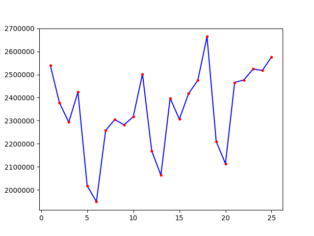
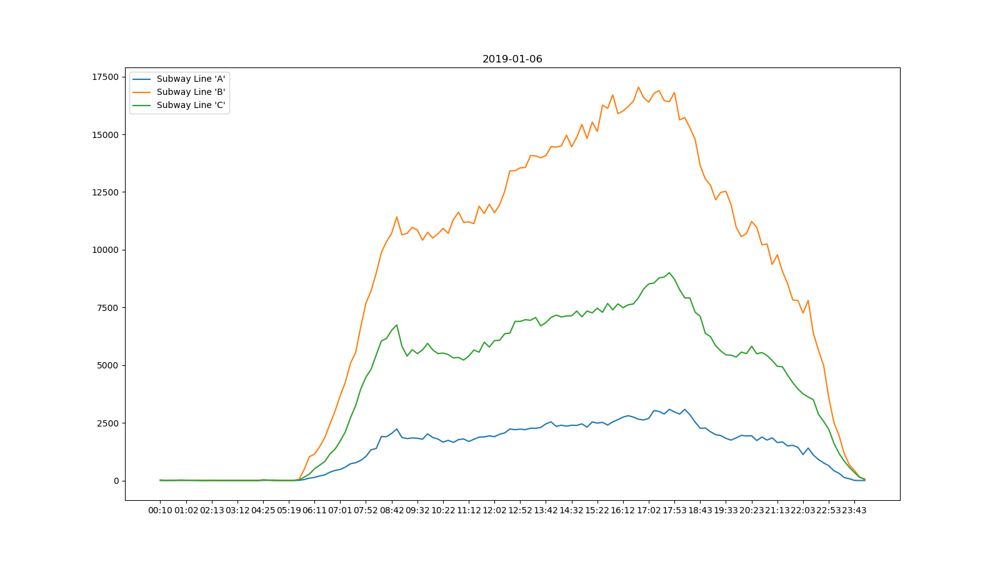

(待续)

天池竞赛城市计算AI挑战赛以“杭州市地铁乘客流量预测”为题，提供了杭州市2019年1月1日到25日的地铁刷卡流量数据，要求预测出未来时间的客流变化情况

# 赛题简介
赛题提供了以下文件
* Metro_train.zip，包含25天的刷卡数据，每天为一个单独的.csv文件
* testA_record_2019-01-28.csv，测试集，用来测试模型性能
* Metro_roadMap.csv，各地铁站点连接关系

刷卡数据格式为

|列名|类型|说明|示例|
|:-|:-|:-|:-|
|time|String|刷卡发生时间|2019-01-02 00:30:53|
|lineID|String|地铁线路ID|C|
|stationID|int|地铁站ID|15|
|deviceID|int|刷卡设备ID|2992|
|status|int|进出站状态，0表示出站，1表示进站|1|
|userID|String|用户ID|C21b87e232a083b3e7d6d45e2ff933e31|
|payType|int|刷卡类型|0|

Metro_roadMap.csv文件中是一个2维矩阵，首行和首列是地铁站ID，roadMap[i][j]为1表示stationID为i的地铁站和为j的地铁站相连，为0表示不相连

# 数据分析
## 初步分析
使用pandas对数据做一个初步分析
### 整体情况
首先读取一个数据文件，查看结构
```python
>>> data = pd.read_csv(path+'/record_2019-01-01.csv')
>>> data.head()
                    time lineID  stationID  deviceID  status                             userID  payType
0  2019-01-01 02:00:05      B         27      1354       0  D13f76f42c9a677c4add94d9e480fb5c5        3
1  2019-01-01 02:01:40      B          5       200       1  D9a337d37d9512184b8e3fd477934b293        3
2  2019-01-01 02:01:53      B          5       247       0  Dc9e179298617f40b782490c1f3e2346c        3
3  2019-01-01 02:02:38      B          5       235       0  D9a337d37d9512184b8e3fd477934b293        3
4  2019-01-01 02:03:42      B         23      1198       0  Dd1cde61886c23fdb7ef1fdb76c9b1234        3
>>>
```
可以看到，文件结构与描述一致，从左到右，列依次为time、lineID、stationID、deviceID、status、userID和payType

```python
>>> data.info()
<class 'pandas.core.frame.DataFrame'>
RangeIndex: 2539592 entries, 0 to 2539591
Data columns (total 7 columns):
time         object
lineID       object
stationID    int64
deviceID     int64
status       int64
userID       object
payType      int64
dtypes: int64(4), object(3)
memory usage: 106.6+ MB
>>>
```
除了首行，数据共2539592条，占用106MB内存

查看描述信息
```python
>>> data.describe()
          stationID      deviceID        status       payType
count  2.539592e+06  2.539592e+06  2.539592e+06  2.539592e+06
mean   2.885803e+01  1.395870e+03  5.002957e-01  1.432034e+00
std    2.190865e+01  1.002121e+03  5.000000e-01  8.313080e-01
min    0.000000e+00  0.000000e+00  0.000000e+00  0.000000e+00
25%    1.100000e+01  5.890000e+02  0.000000e+00  1.000000e+00
50%    2.000000e+01  1.056000e+03  1.000000e+00  1.000000e+00
75%    4.600000e+01  2.196000e+03  1.000000e+00  2.000000e+00
max    8.000000e+01  3.638000e+03  1.000000e+00  3.000000e+00
>>>
```
由描述信息可看出
* 共有253万次刷卡数据
* 地铁站ID从0到80，共81条地铁线
* 刷卡设备ID从0到3638，共3639个刷卡设备
* payType从0到3，共4种刷卡方式

### 基本统计
查看地铁线路统计信息
```python
>>> data.lineID.nunique()
3
>>> data.lineID.value_counts()
B    1677014
C     646253
A     216325
Name: lineID, dtype: int64
>>>
```
共3条地铁线，分别为A、B、C，其中地铁线路B流量最大为167万，C次之为64万，A最小为21万

查看地铁站统计信息
```python
>>> data.stationID.value_counts()
15    357091
9     167448
7      85737
11     75760
10     72913
20     70824
8      64963
24     61774
22     53702
25     51652
33     51514
12     48386
4      45819
13     38674
14     36249
16     33507
29     33227
2      32289
51     31819
46     29982
38     29870
78     29496
57     29271
56     26974
6      26747
58     26328
76     24916
39     24714
63     24493
55     24465
       ...
61     19535
27     19339
62     19279
43     18252
50     18144
70     17751
41     17596
48     17528
34     17422
32     16166
67     15656
45     13837
66     13644
71     13590
73     13041
36     12786
1      12477
44     12349
40     10519
21     10488
79     10328
31     10033
17      9481
64      9176
75      7964
28      7939
35      7466
72      7223
80      6752
74      4642
>>>
```
站点15的流量最大，站点9次之

用户统计分析
```python
>>> user_counts = data.userID.value_counts()
>>> user_counts.shape
(916414,)
>>> user_counts[user_counts>10].shape
(1092,)
>>> user_counts[user_counts>5].shape
(46683,)
>>> user_counts[user_counts==4].shape
(241819,)
>>> user_counts[user_counts==2].shape
(613793,)
>>>
```
由用户统计分析可看出
* 总的地铁出行用户数为91万人
* 只有4.6万人刷卡次数超过5次，1万人刷卡次数超过10次，60万人刷卡次数为2，24万人刷卡次数为4次

### 挖掘规律
由以上基本分析可得出几个关键结论
* 从地铁线路来看，流量大小依次为B>C>A
* 从地铁站来看，15站点流量极高，9站点次之
* 从用户信息来看，大量用户刷卡次数在5次以下，其中66%的用户是单程

由以上结论，提出以下问题
* 为什么B线流量大？
* 为什么15站和9站流量大？
* 为什么单程用户流量大？单程的起始和终点集中在哪些线路和站点？往返用户占多少？

#### 为什么B线流量大？
猜测B线流量大，可能是因为B线站点数量多，B线存在交通枢纽站点，或者B线上某些站点周边覆盖人口密度大

查看各线路站点数
```python
>>> data[data.lineID=='A'].stationID.nunique()
14
>>> data[data.lineID=='B'].stationID.nunique()
34
>>> data[data.lineID=='C'].stationID.nunique()
32
>>>
```
可看到B线站点数量为34最多，C线32站，A线最少，只有14站

查看各地铁线站点流量情况
```python
>>> data[data.lineID=='A'].stationID.value_counts().describe()
count       14.000000
mean     15451.785714
std       7684.061288
min       4642.000000
25%       8555.000000
50%      14623.000000
75%      21201.000000
max      29496.000000
Name: stationID, dtype: float64
>>> data[data.lineID=='B'].stationID.value_counts().describe()
count        34.000000
mean      49323.941176
std       62542.487342
min        7939.000000
25%       21330.250000
50%       32758.000000
75%       53189.500000
max      357091.000000
Name: stationID, dtype: float64
>>> data[data.lineID=='C'].stationID.value_counts().describe()
count       32.000000
mean     20195.406250
std       6149.949336
min       7466.000000
25%      17501.500000
50%      20390.500000
75%      24472.000000
max      31819.000000
Name: stationID, dtype: float64
>>>
```
可看到地铁线A最大站点流量才2.9万，平均在1.5万；B线最大站点流量为35万，平均为4.9万；C线最大流量站点为3万，平均为2万；因此，B线大部分站点流量都较高，例如15站、9站等高流量站点，都属于B线，所以导致B线整体流量较大

#### 为什么15站和9站流量大？
仅仅从训练数据种，无法得出15站和9站的其他信息，站点流量大小很大程度上取决于其周边设施以及本站是否为换乘站

根据赛题给出的站点连接关系，总结出以下交汇点

|站点1|站点2|
|--|--|
|28|20|
|51|9|
|50|10|
|51|10|
|52|10|
|74|5|
|75|5|
|80|15|
|77|46|
|78|46|

根据站点交汇关系，以及各地铁线路的总站点数，再结合[杭州市地铁图](http://map.amap.com/subway/index.html?&3301)，可确定
* B线为1号线、C线为2号线，A线为4号线
* B线站点范围为0~33，其中0为湘湖，5为近江，10为凤起路，15为火车站，20为客运中心，27为下沙滨江，33为临平
* C线站点范围为34~66(54不存在)，其中34为朝阳，46为钱江路，51为凤起路
* A线站点范围为67~80，74为甬江路，75为城星路，77为江锦路，78为景芳

15站为火车站，由于刷卡数据为2019年1月份，临近春节，因此猜测15站流量大是因为春运流量
9站为龙翔桥，经百度地图查看，该站点临近西湖，且周边为商业繁华地带，而读取的数据文件是1月1日元旦，因此流量大

#### 为什么单程用户流量大？
查看单车用户集中在哪些站点
```python
>>> user_counts = data.userID.value_counts()
>>> oneway_users = user_counts[user_counts==2].index
>>> oneway_users
Index([u'Da777d480eb319974721ba1395276b9b9',
       u'Dbb272e5468e0f8f3119affa3548cb2d8',
       u'Ba5b3c0b2fdcc02009044e1745f786a40',
       u'B5be311471b553fa8a1dae68ae2e98e25',
       u'B5c8c3ea1fe6fdb0f70cc264a16a43349',
       u'Dde0d323a4dd433975277717c57525cef',
       u'B55870174fd27626952cb0960a679ba6c',
       u'Ddf91d65e630c39ac4705d1a9789b1dbd',
       u'B3487dabebed8c675e2d72fcaea059ce7',
       u'B775172740ccc61a1856568a09baaa9dc',
       ...
       u'Be838ec43cc032ee398531caa5fd82bdb',
       u'B54815c3bbb7135547c0407d252d1562f',
       u'B703db1dc0f0a9600d7929754ca79e600',
       u'B8fa611fb11119fe7ee4a11d79cd3f6b3',
       u'Dc989f13b188864668cc0e7d9347d946c',
       u'B8f8d236356b772eb4f143796334d2981',
       u'Be37e7163697a8caacdb938546306eec0',
       u'A55804f3d7bf1b47eee1f26e77f7f9acb',
       u'D117ad973c40f4e4a154604f382923fb7',
       u'B3ddd6a228d019312e7ce53fdb4476301'],
      dtype='object', length=613793)
>>>
>>> data[data.userID.isin(oneway_users)].stationID.value_counts()
15    262484
9      60701
7      50871
20     39773
11     37383
24     35208
25     30863
33     27761
10     26101
8      25608
12     20355
22     20302
13     20282
4      20269
       ...
Name: stationID, Length: 80, dtype: int64
>>>
```
单程用户613793人，那么总流量为613793*2=1227586次。单程流量集中在15、9、7、20、11、24、25，15为火车站，9为龙翔桥，7为客运站，20为客运中心，11为商圈和住宅中心，24、25是大学城，因此可判断单程流量主要是由于临近春运的各大车站出入人口，以及元旦假期的出入人口

## 可视化
编写代码，以天为单位，绘制总流量图

由上图可看出，总流量以周为单位，呈周期性变化，规律是周内工作日流量较高，周5到达峰值，周末降到峰谷(除了1月1日的元旦假期)
总的趋势是无论周内周日，随着时间临近春节，整体流量有上升趋势

以时刻为单位，绘制3条地铁线的某天实时流量图，发现所有周内情况与下图类似

整天的流量呈现双峰现象，分别集中在早8点和晚6点，是上下班流量

周末的流量与下图类似


1月1日元旦的流量图如下


### 周内分析
查看数据摘要
```python
>>> data = pd.read_csv(path+'record_2019-01-02.csv')
>>> data.describe()
          stationID      deviceID        status       payType
count  2.376462e+06  2.376462e+06  2.376462e+06  2.376462e+06
mean   3.282597e+01  1.574050e+03  4.998182e-01  1.371589e+00
std    2.340102e+01  1.069709e+03  5.000001e-01  8.458438e-01
min    0.000000e+00  0.000000e+00  0.000000e+00  0.000000e+00
25%    1.300000e+01  6.770000e+02  0.000000e+00  1.000000e+00
50%    2.600000e+01  1.315000e+03  0.000000e+00  1.000000e+00
75%    5.300000e+01  2.565000e+03  1.000000e+00  2.000000e+00
max    8.000000e+01  3.638000e+03  1.000000e+00  3.000000e+00
```
可看到1月2日总流量为2376462

```python
>>> user_counts = data.userID.value_counts()
>>> user_counts.shape
(764188,)
>>> user_counts[user_counts>4].shape
(45376,)
>>> user_counts[user_counts==2].shape
(394674,)
>>> user_counts[user_counts==4].shape
(315658,)
```
总刷卡人数为74万，刷卡数主要集中在单程和往返

#### 查看单程车站分布
```python
>>> user_counts = data.userID.value_counts()
>>> oneway_users = user_counts[user_counts==2].index
>>> data[data.userID.isin(oneway_users)].stationID.value_counts()
15    132302
7      32533
9      27278
4      20530
20     20429
11     19184
33     17023
13     14934
    ...
```
可以看到，单程流量较高的车站有
* 15：杭州东站
* 7：城站
* 9：龙翔桥
* 4：江陵路
* 20：客运中心
* 11：武林广场
* 33：临平
15、7和20客流量大是因为虽然是周内，依然是春运高峰期，或者元旦假期结尾的返程客流；9龙翔桥站靠近西湖景区，且周边有很多商业热点，猜测可能是经常性大流量；其余站点流量大还需要分析原因

##### 查看杭州东站的人流方向
首先查看从杭州东站进的人主要去往哪些站点
```python
>>> s15_in_users = data[data.stationID==15][data.status==1].userID.values
>>> s15_out_users = data[data.stationID==15][data.status==0].userID.values
>>> >>> data[(data.userID.isin(oneway_users)) & (data.userID.isin(s15_in_users)) & (data.stationID!=15)].stationID.value_counts()[0:5]
11    3705
24    3594
25    3453
7     3322
9     3303
Name: stationID, dtype: int64
>>>
```
可看到，从15站进入的人，主要去往了11、24、25、7、9这几个站点，24、25是大学城区域，猜测是元旦假期返程人流；7是靠近杭州火车站，猜测是从东站换乘的春运人流；9站更加可以说明是从火车站来西湖游玩的日常流量；7站比9站里西湖稍远，但是也属于靠近西湖的站点，且周边住宅、商业热点众多，因此猜测也是和到西湖游玩有关

查看去往杭州东站的人主要来自哪些站点
```python
>>> data[(data.userID.isin(oneway_users)) & (data.userID.isin(s15_out_users)) & (data.stationID!=15)].stationID.value_counts()[0:5]
9     3476
7     2442
11    2296
20    1910
33    1864
Name: stationID, dtype: int64
>>>
```
可看到，从15站出站乘坐高铁的人，主要来自9、7、11、20、33几个站点
* 9：西湖游玩返程的人
* 7：春运换乘上高铁
* 11：西湖游玩返程的人
* 20：春运换乘上高铁
* 33：此站点远离市区，猜测可能房价偏低，人口密度大，也是属于春运客流

##### 查看城站的人流方向
```python
>>> data[(data.userID.isin(oneway_users)) & (data.userID.isin(s7_in_users)) & (data.stationID!=7)].stationID.value_counts()[0:5]
15    2442
4     1037
2      721
33     601
0      572
Name: stationID, dtype: int64
>>>
```
可看到从城站进地铁的人流主要去往了15和4站点，15站是因为春运换乘，4站点是因为居住区

```python
>>> data[(data.userID.isin(oneway_users)) & (data.userID.isin(s7_out_users)) & (data.stationID!=7)].stationID.value_counts()[0:5]
15    3322
0      740
4      708
9      647
33     625
Name: stationID, dtype: int64
>>>
```
可看到去往城站的人流，主要来自15站，因为春运换乘

##### 查看龙翔桥的人流方向
```python
>>> data[(data.userID.isin(oneway_users)) & (data.userID.isin(s9_in_users)) & (data.stationID!=9)].stationID.value_counts()[0:5]
15    3476
7      647
14     466
13     453
33     442
Name: stationID, dtype: int64
>>>
```
从龙翔桥出发的人流主要去往了15站，是从西湖游玩返程的

```python
>>> data[(data.userID.isin(oneway_users)) & (data.userID.isin(s9_out_users)) & (data.stationID!=9)].stationID.value_counts()[0:5]
15    3303
7      564
14     532
33     518
13     502
Name: stationID, dtype: int64
>>>
```
去往龙翔桥的人流主要来自15站，是去西湖游玩的

##### 查看江陵路人流方向
```python
>>> data[(data.userID.isin(oneway_users)) & (data.userID.isin(s4_in_users)) & (data.stationID!=4)].stationID.value_counts()[0:5]
15    1472
7      708
2      494
9      426
3      341
Name: stationID, dtype: int64
>>>
```
江陵路人流主要去往15和7站点，是春运出发

```python
>>> data[(data.userID.isin(oneway_users)) & (data.userID.isin(s4_out_users)) & (data.stationID!=4)].stationID.value_counts()[0:5]
15    2287
7     1037
2      436
9      395
0      393
Name: stationID, dtype: int64
>>>
```
江陵路人流主要来自15和7站点，是春运返程

##### 查看客运中心人流方向
```python
>>> data[(data.userID.isin(oneway_users)) & (data.userID.isin(s20_in_users)) & (data.stationID!=20)].stationID.value_counts()[0:5]
15    1910
25     517
7      481
33     470
24     464
Name: stationID, dtype: int64
>>>
```
客运中心人流主要去往15站点，春运

```python
>>> data[(data.userID.isin(oneway_users)) & (data.userID.isin(s20_out_users)) & (data.stationID!=20)].stationID.value_counts()[0:5]
15    1948
33     484
9      390
7      361
29     302
Name: stationID, dtype: int64
>>>
```
客运中心人流主要来自15站点，春运

##### 查看武林广场人流方向
```python
>>> data[(data.userID.isin(oneway_users)) & (data.userID.isin(s11_in_users)) & (data.stationID!=11)].stationID.value_counts()[0:5]
15    2296
7      457
4      387
9      382
14     323
Name: stationID, dtype: int64
>>>
```
武林广场人流主要来自15站点，春运和去西湖游玩

```python
>>> data[(data.userID.isin(oneway_users)) & (data.userID.isin(s11_out_users)) & (data.stationID!=11)].stationID.value_counts()[0:5]
15    3705
7      511
20     456
9      391
33     354
Name: stationID, dtype: int64
>>>
```
武林广场人流主要去往15、7站点，春运和西湖游玩返程

##### 查看临平人流方向
```python
>>> data[(data.userID.isin(oneway_users)) & (data.userID.isin(s33_in_users)) & (data.stationID!=33)].stationID.value_counts()[0:5]
15    1864
7      625
9      518
20     484
31     392
Name: stationID, dtype: int64
>>>
```
临平人流主要来自15站点，春运

```python
>>> data[(data.userID.isin(oneway_users)) & (data.userID.isin(s33_out_users)) & (data.stationID!=33)].stationID.value_counts()[0:5]
15    1895
7      601
20     470
9      442
31     309
Name: stationID, dtype: int64
>>>
```
临平人流主要去往15站点，春运


#### 查看返程车站分布
```python
>>> data[data.userID.isin(twiceway_users)].stationID.value_counts()[0:10]
4     45691
15    44826
9     42756
12    29187
7     28001
16    27825
10    26033
11    25882
22    25470
5     25369
Name: stationID, dtype: int64
>>>
```
返程站点流量前10位为4、15、9、12、7、16、10、11、22、5，查看这些站点附近热点
* 4，市公安局、滨江区政府、武警医院、江锦汽车有限公司、中财、中化、海康威视、吉利集团、百得利
* 9，市第一人民医院、浙大附属产科医院、银泰、天长小学、思鑫坊、胜利剧院、国贸中心、浙江省中医院、惠星中学
* 12，环球中心、科技馆、清园小区、通盛嘉苑、武林府、中山北园、西子花园、河东社区
* 7，建国中路小区、长明寺巷社区、第二中学、葵巷社区、新东方、浙大附属第一医院、银联、国贸、国税局、中闽大厦、国家电网、第六中学、三益里小区、第三人民医院
* 16，宇威德信、三花国际、港龙城、新和嘉苑、德信东望、明月嘉苑、明月嘉苑、夏衍小学
* 10，换乘站、皇亲苑社区、皇后公园、第十四中学、长寿社区、锦绣天地、杭州嘉里中心、建德路小区、凤麟社区、镜瑞弄、国都公寓、麒麟公寓、儿童医院、竹竿巷社区
* 11，国大城市广场、杭州百货大楼、浙信大厦、国信大厦、元通大厦、广发大厦、下城区人民医院、南都天水苑、仓桥社区、天水阳光家园、长江实验小学、天巢花苑、杭州大厦购物城、文化会堂浙江展览馆、浙江展览馆南广场、武林广场、电信大楼、中国电信、天水小学
* 22，经济技术开发区、龙湖滟澜山、龙湖时代金沙天街、德信中外公寓、名城湖左岸、新元社区、金沙城、金沙湖、和达御观邸、上沙锦湖家园、金沙湖公园
* 5，换乘站、杭州市公安局、望江公园、杭州市建兰中学分校、近江东园社区、近江家园、天福花园、滨江新苑、崇文实验学校、胜利小学、开元中学、妇产科医院、万泰城、文华苑、林风花园


####

```python
>>> user_counts = data.userID.value_counts()
>>> twiceway_users = user_counts[user_counts==4].index
>>> data[data.userID.isin(twiceway_users)].stationID.value_counts()
15    132302
7      32533
9      27278
4      20530
20     20429
11     19184
33     17023
13     14934
    ...
```
s13_in_users = data[data.stationID==13][data.status==1].userID.values
s13_out_users = data[data.stationID==13][data.status==0].userID.values
# 模型选择和评估

# 预测结果
