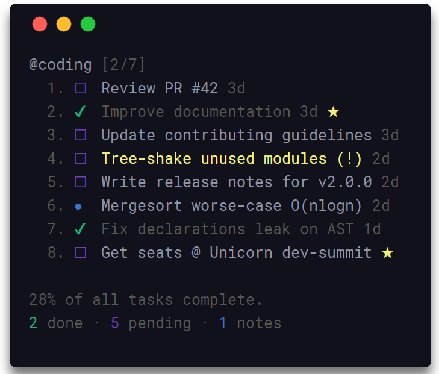
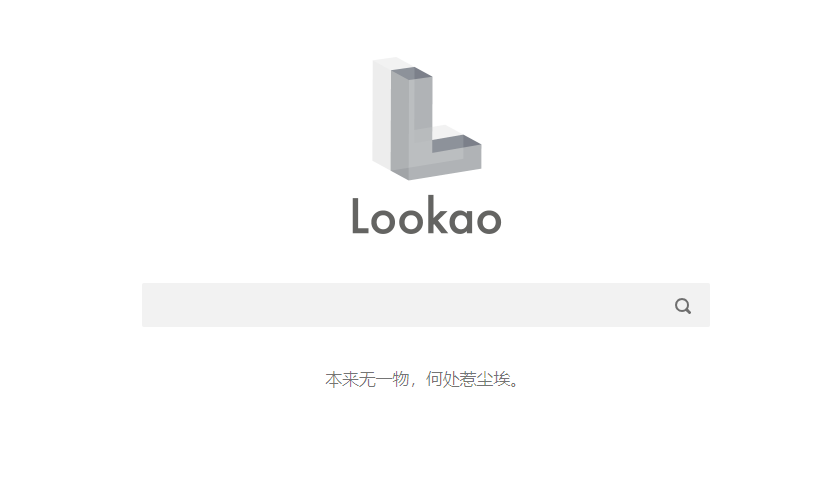

## 新闻
* [树莓派64位系统](http://blog.pifan.org/index.php/knowledge-base/pi64-info/)
树莓派爱好者基地发布的基于Debian64位的树莓派操作系统，对内核进行了魔改、大量深度的优化和BUG修复，加入了很多新的功能和特性，特别是加入了KVM虚拟化的支持以及重点加强了对Docker的各项特性支持和优化。关键特性如下
  * WEB SSH
  * QEMU-KVM 虚拟机
  * KVM 虚拟化的支持选项
  * Docker
  * AUFS
  * Swap
  * zSWAP
  * USB启动
  * UEFI启动
  * TCP加速

## 资源
* [tensorflow playground](http://playground.tensorflow.org/#activation=relu&batchSize=10&dataset=circle&regDataset=reg-plane&learningRate=0.03&regularizationRate=0&noise=0&networkShape=4,2&seed=0.37490&showTestData=false&discretize=false&percTrainData=50&x=true&y=true&xTimesY=false&xSquared=false&ySquared=false&cosX=false&sinX=false&cosY=false&sinY=false&collectStats=false&problem=classification&initZero=false&hideText=false)
Tensorflow官方发布了一个可视化神经网络结构的web，可选择一些数据分布，调整学习速率、激活函数、网络结构等，运行并实时查看网络的训练情况

* [taskbook](https://github.com/klaussinani/taskbook)
一个命令行的任务管理工具

* [lookao](https://lookao.com/)
一个干净的搜索引擎，不会追踪和监控用户隐私

* [arXiv](https://arxiv.org/list/cs.CE/recent)
一个免费的论文网站，包括数学、物理、计算机、统计、天文、定量生物、定量金融等领域的研究论文

* [codelf](https://github.com/unbug/codelf)
一个github开源项目，用于帮助给代码中的变量或者函数起名，web访问地址：[https://github.com/unbug/codelf](https://github.com/unbug/codelf)