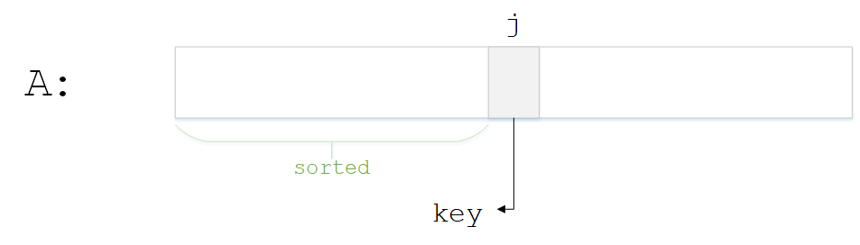
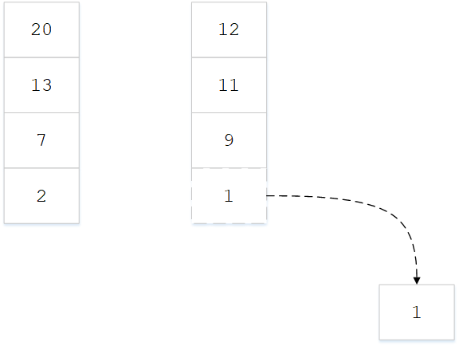

课程内容主要分为两个部分：算法分析和算法设计。算法分析是理论研究，研究计算机程序的性能和资源利用，尤其关注性能，也考量其他方面如通信、存储(内存、磁盘)等

## 排序算法例子
输入一组序列 $$ a_{1},a_{2},...,a_{n} $$，按照从小到大的顺序排列后输出

使用插入排序算法来完成，伪代码如下
```
For j=2 to n
    key = A[j]
    i = j-1
    while i>0 and A[i]>key
        A[i+1] = A[i]
        i -= 1
    A[i+1] = key
```

该算法有两层循环，外层循环j从2到n递增，内层循环i从j-1到0递减。任意一次循环前的情况如图所示

关键点如下
* 将数组j位置的元素提取出来，记作key
* 0到j-1位置的元素为已排列sorted
* 循环的目的就是使sorted部分增长1

循环步骤如图所示

做法是一步步将前一个元素拷贝到后一个位置，直到找到key值的合适位置，插入进去

## 排序算法分析
### 运行时间
算法的运行时间取决于很多因素
* **输入本身** 如果输入本身已经是排好序的或者部分排好序的，剩余的工作就很少；而最坏的情况是逆序，所有的元素都要重新调整
* **输入规模** 将运行时间看作数据规模的函数
* **运行时间的上界** 运行时间不会超过的某个值，这代表对用户的一种承诺；如果关注运行时间最快是多少是没有意义的，因为一个很烂的算法在输入本身已经排好序的情况下也可以很快

### 各种类型的分析
* **最坏情况分析** 通常最关注这个，定义$T(n)$为输入规模为$n$时的最长运行时间，
* **平均情况分析** 这里$T(n)$是输入规模$n$之下所有可能输入的期望时间，而计算期望，必须假定或者给出输入的统计分布(如均匀分布、正态分布等)
* **最好情况分析** 这是一种假象，没啥用

那么，插入排序的最坏情况消耗多少时间？首先取决于运行该算法的计算机，计算能力是多少。当比较算法时，比较的是相对速度，即在相同的计算机上作比较。当然，也会关心其绝对速度，一个算法，无论在什么样的机器上，其能力都可以用一种形式表示，那就是算法的大局观——渐进分析

### 算法大局观——渐进分析
渐进分析的基本观点
* 忽略掉依赖于机器的常量，
* 不去检查实际的运行时间
* 关注运行时间的增长

定义$\Theta$符号，表示弃去低阶项，忽略常数因子。例如公式为$3n^{3}+90n^{2}-5n+6046$，最高阶是3阶，因此2阶项和1阶项都去掉，常数项也去掉，则该公式为$\Theta(n^{3})$

当$n \to +\infty$，可知总是存在一个$n$，使得$\Theta(n^{2})$的算法优于$\Theta(n^{3})$的算法，无论其他低阶项和常数项是什么；即使在一台慢速机器上运行$\Theta(n^{2})$，而在快速机器上运行$\Theta(n^{3})$，也不影响$\Theta(n^{2})$超过$\Theta(n^{3})$

$\Theta$符号的好处在于可以满足对相对速度和绝对速度的双重比较要求，因为无论在什么计算机平台上都能实现这一点，在不同平台上也许只差一个常数因子，但随着输入规模变大，渐进结果是准确的，如图

总会存在一个$n_{0}$，当$n > n_{0}$时，$\Theta(n^{2})$比$\Theta(n^{3})$的时间开销更小。但是有些时候，$n_{0}$的值过大，大到计算机无法运行该算法，这也是某些情况下对相对低速的算法也感兴趣的原因，因为低速算法尽管用渐进的视角来看，最终可能比较慢，但是让然可以在合理输入范围内运行更快。因此需要在数学理论和工程直觉之间做权衡

### 排序算法的最坏情况
最坏情况是输入是逆向排序，每次循环都要把所有元素移动一次。假设每一条代码指令或原子操作都耗费某固定常数时间，而这个常数是多少无关紧要。外层循环从$j=2$到$n$，对于j的每一次取值，循环体的执行耗时应该是$j$乘以某个常数，则耗时为$\Theta(j)$。因此排序算法的总时间消耗为

\begin{equation}
T(n) = \sum_{i=1}^{n} \Theta(j)
\end{equation}

如何简化该公式呢？这是一个求和表达式，具体来说是等差数列求和，等差数列求和公式为

\begin{equation}
S(n) = na_{1} + \frac{n(n-1)}{2} d
\end{equation}

最高阶次为2次，省略掉常数项和低阶项，等于$\Theta(n^{2})$，即
\begin{equation}
T(n) = \sum_{i=1}^{n} \Theta(j) = \Theta(n^{2})
\end{equation}

因此，对于较小的$n$，插入排序的速度还可以，但是$n$足够大时，插入排序效率就比较低了

## 并归排序
对于数组`A[1...n]`的并归排序，有3个步骤
1. 如果`n=1`，认为已经排好序了
2. 递归地对A[1到n/2向上取整]和A[n/2向下取整到n]这两部分排序
3. 把排好序的两个表并归

关键的子程序在于并归，下图中是两个已经排好序的数组，首先判断两张表中最小元素是多少，最小元素一定在两张表之首；然后将最小的元素拿出来

重复以上步骤，每次从两个表头取出最小的元素排在新数组的后面


### 分析性能
并归算法的$T(n)$是多少？该算法的3个步骤中，第1步只需要常数时间；第2步可以
